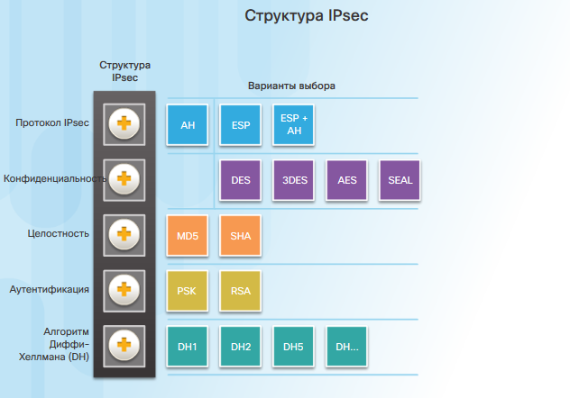
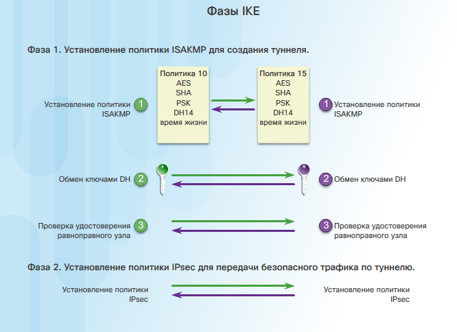

# Глава 8. Внедрение виртуальных частных сетей (VPN)

**Разворот пакетов (Hairpinning)** – термин, используемый для описания ситуации, при которой VPN-трафик, входящий в интерфейс, также может маршрутизироваться на выходе из того же интерфейса.

**Метод разделенного туннелирования (Split tunneling)** - Если трафик предназначен для корпоративной подсети, он отправляется через VPN-туннель. В противном случае он отправляется в виде нешифрованного (недоверенного) трафика в Интернет.

## Компоненты сети IPsec VPN и их функционирование

**Алгоритм Диффи-Хеллмана (DH)** - это метод обмена открытыми ключами, с помощью которого два равноправных узла могут установить общий секретный ключ, который знают только они, даже в том случае, если эти узлы взаимодействуют друг с другом по незащищенному каналу. 
- Группы DH 1, 2, 5 не рекомендуется использовать после 2012 года.
- Группы DH 14, 15, 16 рекомендуется использовать до 2030 года.
- Группы DH 19, 20, 21, 24 предпочтительные методы.

***

Основными протоколами IPsec являются:
- Authentication Header (AH)
- Encapsulation Security Protocol (ESP)

В зависимости от выбора основного протокола будут выбраны какие структуры (_как на картинке_) будут использованы.

Основное отличие ESP от AH - это поддержка шифрования.

Оба протокола ESP и AH могут работать в *Транспортном* или *Туннельном* режимах. 

**Транспортный режим** - защищает полезную нагрузку в IP пакете, но поля пакета (в том числе адресацию) оставляет открытыми. 

**Туннельный режим** - исходный IP пакет полностью шифруется, а затем инкапсулируется в новый IP пакет.

***

**Протокол IKE** - используется вместе с IPsec для упрощения настройки IPsec. Он создает SA (Security Association) для согласования параметров IPsec между сторонами. 

Это гибридный протокол, реализующий протоколы обмена ключами на базе платформы Internet Security Association Key Management Protocol (ISAKMP). ISAKMP определяет формат сообщений, механизм протокола обмена ключами и процесс согласования.

>Часто Ciso использует названия ISAKMP и IKE как взаимозаменяемые, но на самом деле IKE включает в себя функции нескольких протоколов, а именно: ISAKMP, SKEME и OAKLEY. [Ссылка](https://networkengineering.stackexchange.com/questions/1/whats-the-difference-between-ike-and-isakmp)

IKE использует UDP порт 500.

**Фазы IKE:**

- Фаза 1 устанавливает SA для безопасного обмена информацией о формировании туннеля следующего протокола (чаще всего IPsec). Эта фаза настраивается на Cisco с помощью: _crypto isakmp policy_ и проверяется: _show isakmp policy_. Фаза 1 может быть реализована в двух вариантах:
	- **Main Mode** - более долгий, но безопасный метод. Фаза 1 устанавлявает параметры туннеля несколькими зашифрованными порциями сообщений.
	- **Agressive Mode** - быстрый, но небезопасный метод. Фаза 1 устанавлявает параметры туннеля одним незашифровным сообщением.

- Фаза 2 устанавливает SA по безопасному туннелю фазы 1, но уже непосредственно основным протоколом (чаще всего IPsec).

**IKEv2** - поддерживает функцию NAT-T для установления связи через NAT. При NAT-T пакеты ESP инкапсулируются в UDP с портом 4500. IKEv2 не дает выбора режима ( _Main или Agressive mode_ ) на фазе 1.

После настройки фаз соединения, фаза 1 начинат устанавливаться только после обнаружения "интересного трафика", указанного в ACL.

>IPsec поддерживает только одноадресный трафик. Если по туннелю планируется обмен многоадресным или широковещательным трафиком (напр. для протоколов динамической маршрутизации), то необходимо настроить IPsec с туннелем GRE. Т.е. IPsec инкапсулируются в GRE, а GRE инкапсулируется в новый IP пакет.

***

**Задачи по настройке IPsec VPN:**

- Задача 1. Настройка ISAKMP для IKE Phase 1.
- Задача 2. Настройка IPsec для IKE Phase 2.
- Задача 3. Настройка криптокарты для политики IPsec.
- Задача 4. Применение политики IPsec.
- Задача 5. Проверка работы туннеля IPsec.

**Задача 1. Настройка ISAKMP для IKE Phase 1:**

Для выполнения этой задачи Cisco IOS поставляет 7 предустановленных настроек, которые можно просмотреть с помощью комманды:

> \# show crypto isakmp default policy

Стороны начинают пытаться установить согласование с политик с меньшим приоритетом.

Если стандартные политики не устраивают администратора, то необходимо создать новую политику ISAKMP.

Для настройки новой политики ISAKMP используются следующие команды. Пример:

> (config)# crypto isakmp policy _<приоритет политики от 1 до 10000>_
>
> (config-isakmp)# hash sha
>
> (config-isakmp)# authentication pre-share
>
> (config-isakmp)# group 24
>
> (config-isakmp)# lifetime 3600
>
> (config-isakmp)# encyption aes 256

Для запоминания настроек для ISAKMP можно использовать мнемонику - **HAGLE**:

- Hash
- Authentication
- Group
- Lifetime
- Encryption

Настройка pre-shared key:

> (config)# crypto isakmp key _<ключ>_ address <ip address или hostname удаленной стороны>

Настройка "интересного трафика" для туннеля с помощью ACL:

> (config)# access-list 101 permit ip _<source network>_ <wildcard mask> <destination network> <wildcard mask>_ 

