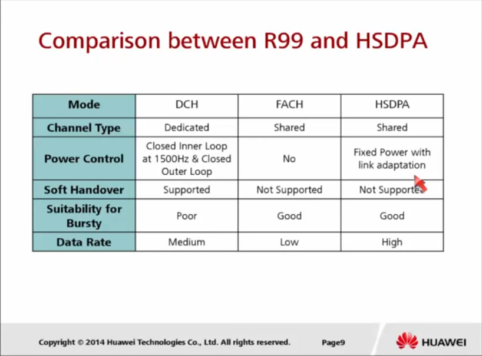
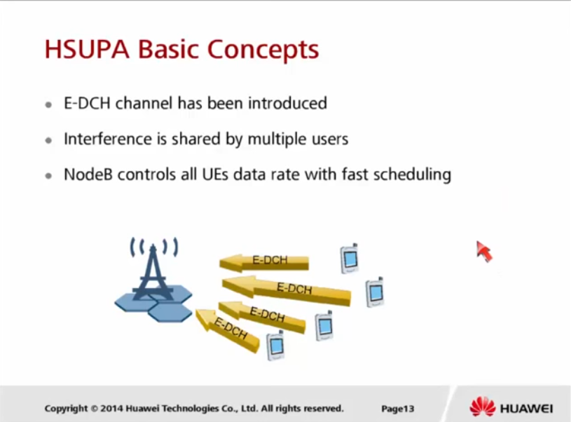
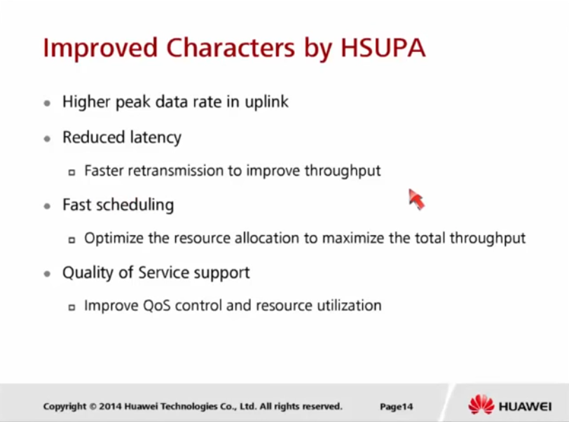
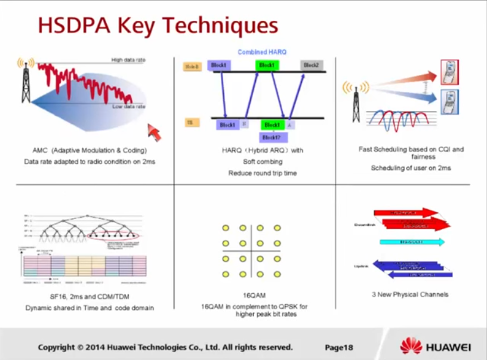

# Технологии HSPA и HSPA+

## Обзор HSPA & HSPA+

**HSDPA** - High Speed Downlink Packet Access

В первом релизе HSDPA (Release 5) уже была заявлена скорость в 14Mbps на пользователя. 

Недостаток WCDMA (Release 99) в том, что выделение канала абоненту происходит с определенной схемой кодирования и модуляции, без учета **изменения радио-условий абонента**. А на общем канале (FACH) вообще не было ни подстройки мощности, ни подстройки схемы модуляции.

**Ограничения в Release 99 Downlink:**

- В выделенных каналах - Dedicated channel (DCH)

	- Максимальная скорость 384 kbps

	- Ограничение OVSF кодов для абонентов с высокой скоростью передачи данных

	- Медленные измнения параметров канала

	- Медленный механизм Outer Loop Power

*Выделенный канал Release 99 не удовлетворял основной потребности Интернета - передачи "вспышек данных". Т.е. в не зависимости от получения или не получения данных, пользователь все равно занимает канал.*

- В общем канале - Common Channel (FACH)

	- Хорош для передачи "вспышек данных" (умеет включаться/отключаться)

	- Поддерживает только низкие скорости

### HSDPA основная концепция

- Создать достаточно высокоскоростные каналы

- Разделить эти каналы между пользователями 

- Каждому пользователю все все или часть высокоскоростных каналов, каждые 2 ms, но только в том случае, если данные этого пользователя уже пришли в буфер на NodeB, если не пришли, то никакие ресурсы не выделяются и передаются данные других пользователей. 

**Ограничения WCDMA преодолеваются с помощью:**

- Адаптивной модуляции и кодирования (adaptive modulation and coding)

  - Базируется на фидбеках (Fast feedback) об условиях канала, которые присылает UE каждые 2 ms

  - На основе фидбеков выбирается схема модуляции (QPSK и 16QAM)

  - На основе фидбеков выбирается скорость кодирования от 1/5 до 1

- Ограничение по использовании скорости

  - Один пользователь может использовать несколько каналов HSDPA (до 15 каналов)

  - Все каналы имеют один фиксированный spreading factor, который равен 16

- На физическом уровне используется **HARQ (Hybrid Automatic Repeat reQuest)**

### Сравнение Release 99 и HSDPA

### HSUPA основная концепция

В отличии от Release 99 в HSUPA появилась технология E-DCH для выделенного канала (DCH). Базовая станция контролируют интерференцию между устройствами. Если обший уровень интерференции не превышает норму, то уменьшается spreading factor и увеличивается мощность и скорость передачи данных, и наоборот если норма превышена. 

### HSUPA Улучшения

### HSPA+

HSPA+ это улучшение HSDPA и HSUPA.

**Цели улучшения:**

- Уменьшение задержке обслуживания

- Увеличение пиковых скоростей

- Улучшение эффективности использования спектра

- Увеличение мощностей

- Уменьшение потребляемой мощности на UE

## Знакомство с HSDPA

### Ключевые технологии используемые в HSDPA

- **AMC (Adaptive Modulation & Coding)** - схемы модуляции и кодирований изменяются для каждого **субфрейма** для каждого абонента в соответствии с его радио-условиями.

*субфрейм - это понятие появляется в HSDPA, его длительность 2ms.* 

- **Динамическое разделение ресурсов во временном и кодовом домене**

- **HARQ (Hybrid Automatic Repeat reQuest)**

*по умолчанию, на большинстве устройств, повторные передачи HARQ равно 4*

- **Модуляция 16QAM** (одновременно передается 4 бита)

- **Быстрое формирование очереди на основе CQI и принципу справедливости (fairness)**

- **Три новых физических канала**

## AMC (Adaptive Modulation & Coding)

**AMC** выбирается в соответствии с [CQI (Channel Quality Indicator)](https://ytd2525.wordpress.com/2014/02/02/cqi-channel-quality-indicator/), который передается от UE на NodeB.

