# Структура современных сетей мобильной связи (GPRS,UMTS,LTE)

## Оглавление

- [Архитектура 2G сетей (GSM/GPRS)](#архитектура-сетей-2g)
  - [GPRS Control Plane (плоскость управления - сигнализация)](#gprs-control-plane-плоскость-управления---сигнализация)
  - [GPRS User Plane](#gprs-user-plane)
- [Архитектура 3G сетей (UMTS)](#архитектура-сети-umts-3g)
  - [Интерфейсы в Packet-Switching домене в UMTS (3G + 2G) на базе IP](#интерфейсы-в-packet-switching-домене-в-umts-3g--2g-на-базе-ip)
  - [Функции устройств в UMTS](#функции-устройств-в-umts)
  - [UMTS Control Plane](#umts-control-plane)
  - [UMTS User Plane](#umts-user-plane)
- [Архитектура 4G сетей (LTE)](#архитектура-сети-lte-4g)
  - [Сосуществование сетей LTE с 2G/3G сетями](#сосущестование-сетей-lte-с-2g3g-сетями)
  - [Функции устройств в LTE](#функции-устройств-в-lte)
  - [Голосовой домен в LTE (IMS)](#голосовой-домен-в-lte)
  - [Роуминг в LTE](#роуминг-в-lte)
  - [Стек протоколов E-UTRAN](#стек-протоколов-e-utran)
  - [Протокол Diameter](#протокол-diameter)
- [Вопросы для самопроверки](#вопросы-для-самопроверки)

*Оглавление в логическом порядке*

## Эволюция сетей сотовой связи

**1G:**

1. AMPS

2. TACS

3. ETACS

**2G:**

1. GSM

2. CDMA One (IS-95)

3. DAMPS (IS-136)

4. DAMPS (IS-136)

**3G:**

1. UMTS WCDMA

2. TD-SCDMA

3. CDMA2000 EVDO

4. WiMAX

**4G:**

1. LTE Advanced

2. UMB EV-DO Rev C

3. WiMAX 802.16m

## Архитектура сетей 2G 

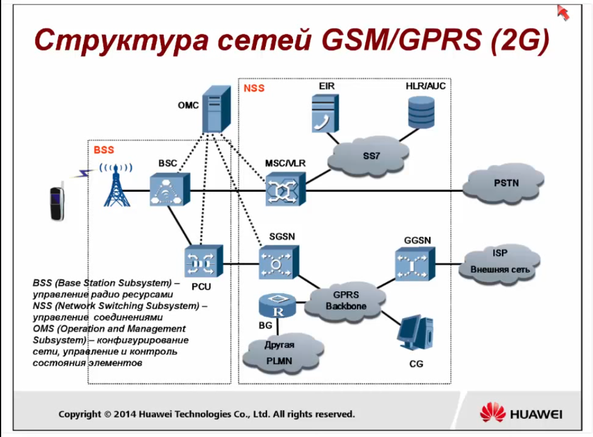

Голосовой трафик проходит от BSC через MSC в ТСОП (Телефонную сеть общего пользования aka PSTN) и этот путь является голосовым доменом - сетью коммутации каналов (Circuit Switch Domain). *(PS включая EIR и HLR)*

**BSC** - занимается управлением радио-ресурсами и управлением базовыми станциями. 

**MSC (Mobile Switching Center)** - управляет соединениями. С ним совмещен **VLR (Visited Location Register)**, который отвечает за регистр абонентов и с ним соединен **HLR (Home Location Register)**, который хранит данные абонентов и их подписки. Данные от HLR к MSC передавались по сигнальному каналу SS7. А устройство **EIR (Equipment Identity Register)** ведет черные/белые списки телефонов, большинство операторов отказались от его использования.

Такие устройства как **PCU (Packet Control Unit)**, **SGSN**, **GGSN** были добавлены с появлением в сетях 2G GPRS домена, который имел большие скорости, чем голосовой домен. **PCU** - обеспечивал связь BSC с этим доменом. *(PS т.е. по сути появилась "пакетная" часть сети)*

**Архитектура 2G BSS:**

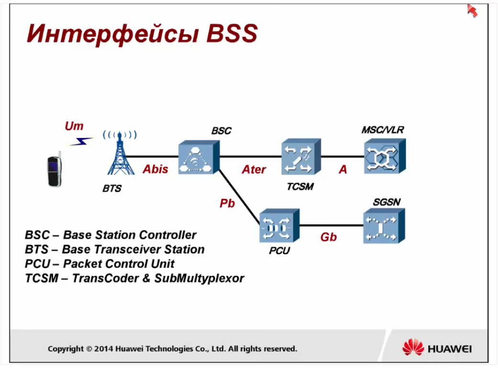

**Изменение в CS-домене 2G в 3GPP Release 4:**

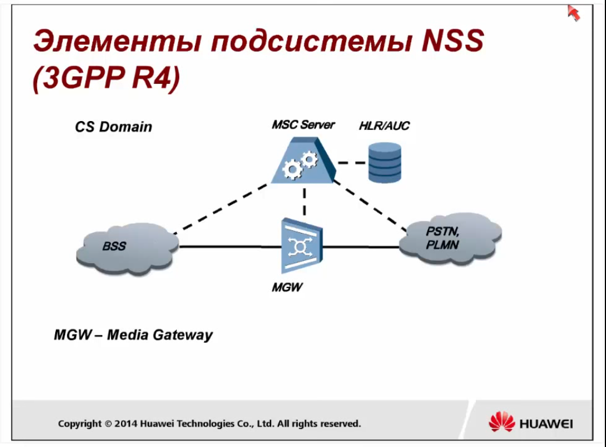

В 2004 году в 3GPP Release 4 было принято разделить MSC на две части **MSC Server**, который дает сигнализацию MGW на коммутацию трафика и **MGW (Media Gateway)**. MGW приближаются к BSS подсистеме, а MSC Server остается один на регион.

**Элементы подсистемы GPRS (пакетный домен 2G):**

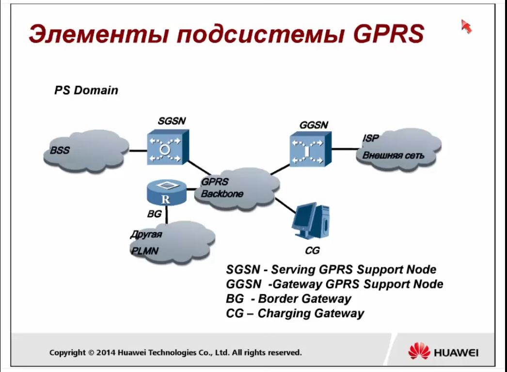

Пример роуминга (Roaming). Если в Россию приезжает абонент из Америки, то **SGSN** переключает его через **BG** в его родную сеть (Америку) этот канал приходит на **GGSN** находящийся к Америке и он получает свой Американский ip-адрес. **CG** отвечает за биллинг абонентов, т.е. сколько трафика перестал абонент в направлениях UpLink и DownLink.

## Архитектура сети UMTS (3G) 

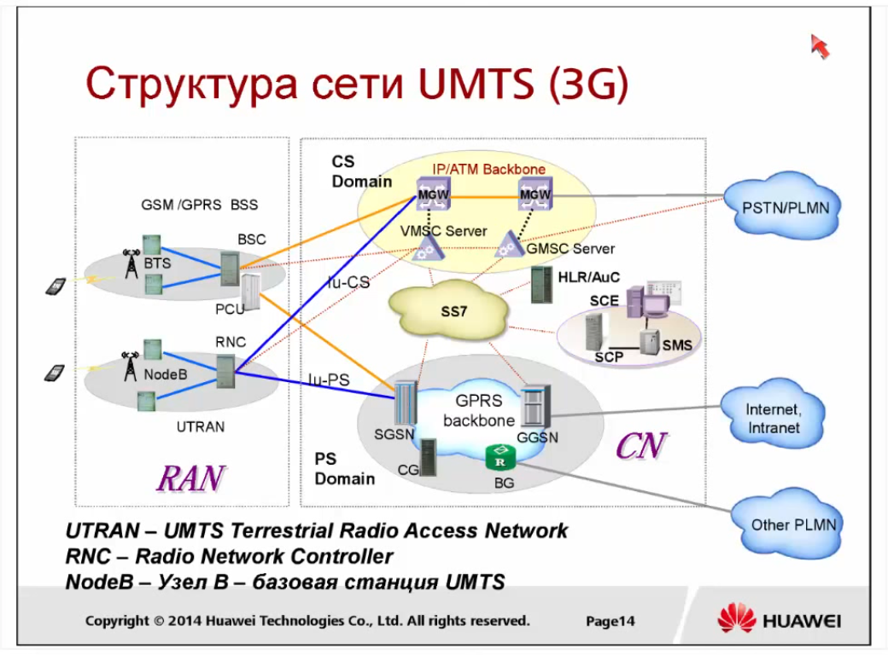

В архитектуре 3G добавляется еще один домен **RAN (Radio Access Network)**. RAN включает в себя **NodeB** (базовую станцию) и **RNC (Radio Network Controller)**.

### Интерфейсы в Packet-Switching домене в UMTS (3G + 2G) на базе IP

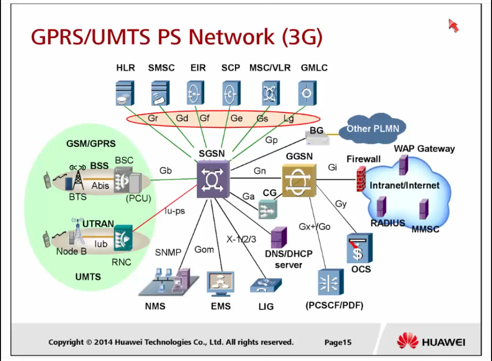

**SCP (Service Control Point)** - подключается через интерфейс Ge к SGSN. Это устройство может отключить абонента, когда у него закончились деньги на счету.

**SMSC (SMS Center)** - подключается через интерфейс Gd.

**MSC/VLR** - подключается к SGSN, через интерфейс Gs. От SGSN к MSC/VLR может прийти запрос на пейджинг, если абонент находится в режиме пакетного соединения.

**GMLC (Gateway Mobile Location Center)** - подключается к SGSN через интерфейс Lg. Это устройство позволят находить местоположение абонента, на основе данных, которые передает радиоподсистема.

**OCS (Online Charging System)** - подключается к GGSN через интерфейс Gy. Это система занимающаяся **горячим биллингом**.

**EMS (Element Managment System)** - подсистема для обслуживания отдельных элементов.

**NMS (Network Managment System)** - мониторинг и управление сетью.

**Location Area** - зона порядка 100 сот

**Routing Area** - часть LA (Location Area) используется SGSN

Но сейчас часто операторы приравнивают Location Area к Routing Area.

### Функции устройств в UMTS

**Функции SGSN:**

1. Mobility Managment (Управление мобильностью) - отслеживание зоны нахождения абонентской станции

2. Session Managment (Управление сессиями)

3. Routing and transfer packets (Маршрутизация и передача пакетов)

4. Charging - генерация биллинговых записей (CDR - Call datail record - когда и в какой соте сколько трафика абонент скачал)

**Функции GGSN:**

1. Управление сессиями (Определение параметров качества сервиса и ширины полосы и выделение ip-адреса)

2. Маршрутизация и передача пакетов (практический GGSN является маршрутизатором)

3. Charging - ведение биллинговых записей

**Функции CG:** - сбор, временное хранение, предварительная обработка и передача GPRS CDRs биллинговому центру

**Функции HLR/AuC:**

1. Сохранение и обновление данных об абонентах GPRS и подписанных услугах

2. Аутентификация (генерация триплетов/пентиплетов)

3. Сохранение информации о местенахождения абонента и его доступности

**Функции DNS:**

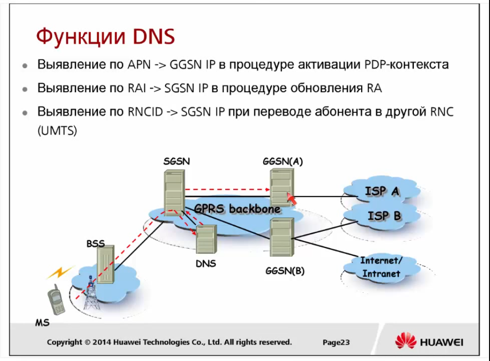

APN (Access Point Name) храниться на каждом абонентском устройстве и привязан к определенному GGSN'у, либо группе GGSN. Когда абонент подключается к GGSN, он отправляет этот APN. А SGSN обращается к DNS серверу и по переданному APN получает ip адрес GGSN соответствующего APN, происходит это в процессе активации PDP - контекста, т.е. активации соединения.

**Функции BG (Border Gateway):** - Обеспечивает маршрутизацию и безопасную передачу данных (через туннелирование в другие PLMN). Поддерживает IPSEC and firewall и BGP.

### GPRS Control Plane (плоскость управления - сигнализация)

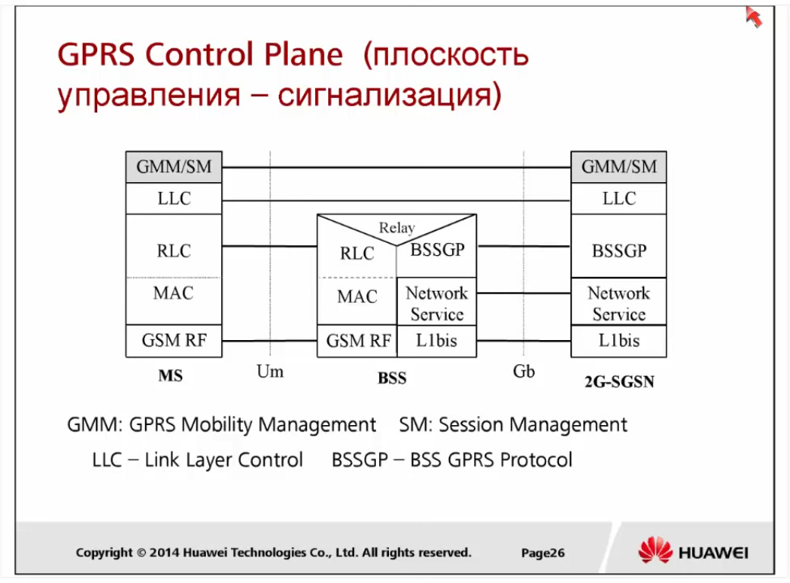

В мобильной связи принято все интерфейсы делить на две плоскости:

1. Плоскость управления передачи сигнальных сообщений (Control Plane)

2. Плоскость передачи пользовательского трафика

**LLC (Link Layer Control)** - обеспечивает целостность передачи сообщений GMM/SM (GPRS Moblility Managment и Session Managment) и при необходимости их перезапрашивает

**RLC (Radio Link Control)** - добавляет каждому пакету контрольную сумму и приемная сторона сравнивает совпадение контрольных сумм.

На интерфейсе Um между MS и BSS работает BSSGP (BSS GPRS Protocol), который обеспечивает организацию сигнального соединения для абонента. Это сигнальное соединение для абонента осуществляется в рамках линка, которое обозначается как Network Service. В Network Service каждому соединению между BSS и SGSN ставится в соответсвие некий идентификатор и этот идентификатор передается в пакетах, который должны быть доставлены от BSS на SGSN и обратно.

**MAC (Medium Access Control)** - обеспечивают очередность передачи сигнальных сообщений на радио интефейсе. (распределяет сообщения по соответствующим физическим каналам)

**GSM RF** - радио-уровень передачи GSM. Т.е. сигнальных сообщения инкапсулируются в соответствующие каналы GSM.

### UMTS Control Plane

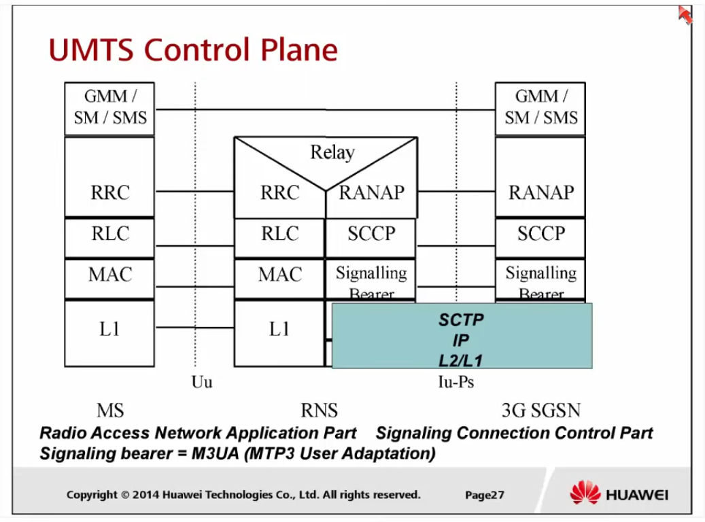

Сообщения GMM, SM, SMS передаются поверх соединения, которое создается на радиоинтерфейсе соединением **RRC (Radio Resource Control)**.

**RRC (Radio Resource Control)** - это по сути сигнальное сообщение между мобильной станцией и контроллером RNC, которое кроме обеспечения передачи сигнализации позволяет инкапсулировать в эти сигнальные сообщения сигнализацию, того что называется Non-access stratum, т.е. сигнализацию идущую от мобильной станции к SGSN.

**RANAP (Radio Access Network Application Part)** - работает на интерфейсе между RNC и SGSN. Этот протокол относится к **ОКС-7**. Он в соответствии с ОКС-7 работает поверх SCCP.

[Ссылка на статью про ОКС-7, которая в мире называется SS7](http://pro-gprs.info/theory/sccp_routing.html)

**SCCP (Signaling Connection Control Part)** -  стандартный протокол ОКС-7, обеспечивающий маршрутизацию сигнальных сообщений между разными подсетями и также обеспечивающий доставку сигнальных сообщений.

**Signalling Bearer** - в настоящий момент (для ip сетей) это соединение организуемое на основе протокола M3UA (MTP3 User Adaptation). Другими словами Singalling Bearer = M3UA.

*Как вы помните, раньше, если вы занимались ОКС-7, то должны знать что, что MTP3 (Message Transfer Part) 3-его уровня занималась маршрутизацией пакетов ОКС-7 в пределах одной подсети. В настоящее время эту функцию выполняет ip сеть. Поэтому необходимость в наличии маршрутизирующего заголовка в сообщениях MTP3 отпало. И соответственно в настоящее время в сети используется M3UA, это упрощенные пакеты MTP3, содержащие упрощенный заголовок.*

**SCTP (Stream Control Transmission Protocol)** - как TCP, но позволяет осуществлять многопоточность.

**Control Plane: SGSN to HLR**

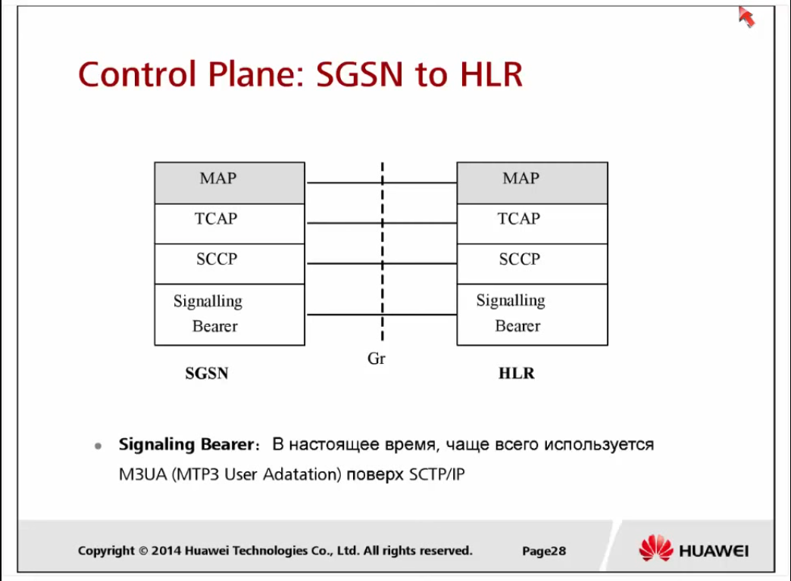

**Control Plane: SGSN to GGSN**

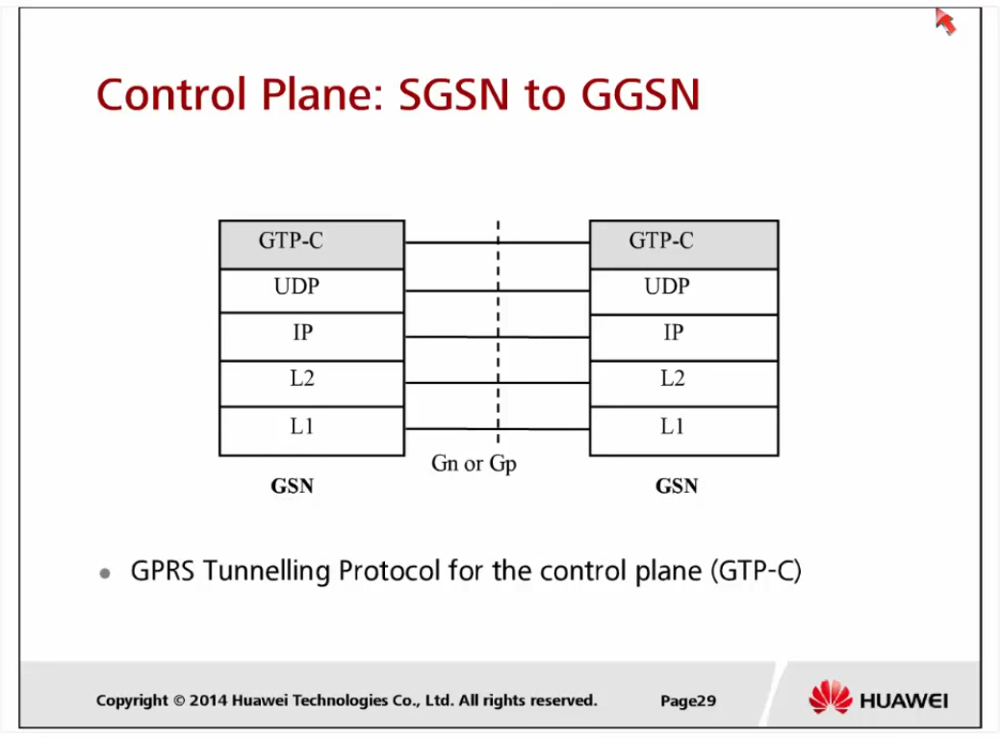

### GPRS User Plane

### UMTS User Plane

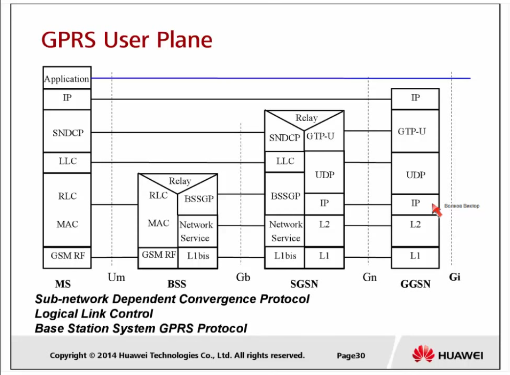

*На картинке протокол ATM и AAL5 надо заменить на Ethernet. (L1+L2)*

**PDCP (Packet Data Convergence Protocol)** - пользовательские ip пакеты разбиваются в соответствии с возможностью радиоинтерфейса

## Архитектура сети LTE (4G)

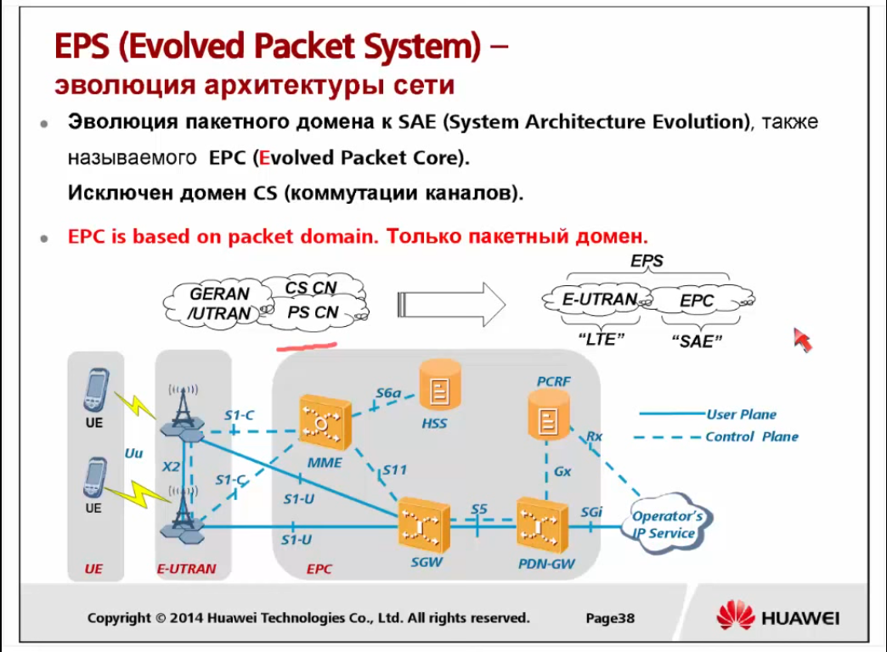

В LTE исключается домен коммутации каналов (CS CN).

Часть E-UTRAN включает базовые станции, которые называются **eNodeB (Envolved NodeB)**. Отличие eNodeB от NodeB в том, что eNodeB включают в себя, то что раньше называлось контроллером сети (RNC).

В связи с этим появляется задача оптимизировать хэндоверы, для этого появляются интерфейсы X2, между eNodeB.

Интерфейсы между E-UTRAN и EPC называются **S1** и делятся на control plane (S1-C) и user plane (S1-U).

В LTE, SGSN разделяется на 2 элемента:

1. **MME (Mobility Management Entity)** - занимается искючительно обработкой сигнализации

2. **SGW (Serving Gateway)** - осуществляет коммутацию/маршрутизацию пакетного трафика

**HSS (Home Subscriber Server)** - выполняет функции HLR и AuC + доп. функции

**PCRF (Policy and Charging Rules Function)** - выделяет при необзодимости пользователям дополнительные приоритетные канала и тарифицировать эти каналы в соответствии с тарифными планами пользователей

**PGW (PDN Gateway - Packet Data Network Gateway)** - соединяет EPC с другими внешними сетями.

### Сосущестование сетей LTE с 2G/3G сетями

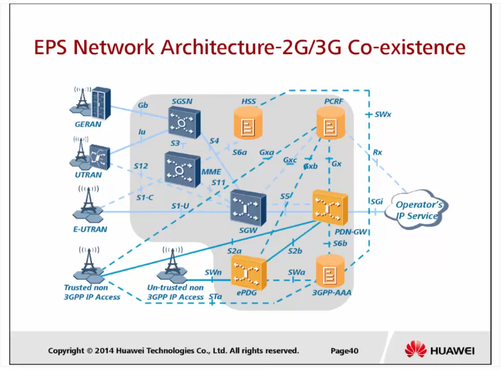

Появляюся интерфейсы S3 между SGSN и MME и S4 между SGSN и SGW.

**Интерфейс S3** - обменивается сигнальной информацией между SGSN и MME при хэндовере абонента между 2G/3G и 4G сетями

**Интерфейс S4** - при хэндовере абонента из LTE в GERAN и UTRAN у него не должен меняться ip адрес. Для этого должна общая точка, в частности этой точкой может быть PGW. Соответственно, даже если абонент подключился в GERAN его трафик должен передаваться c SGSN на SGW (по интерфейсу S4) и дальше на PGW и дальше в ip сеть. Если абонент из UTRAN, то трафик может идти также в SGSN и дальше в интерфейс S4, либо от UTRAN сразу в SGW через директ туннель **интерфейса S12**.

*В LTE понятия Location Area и Routing Area заменены на Tracking Area*

### Функции устройств в LTE

**Функции MME**

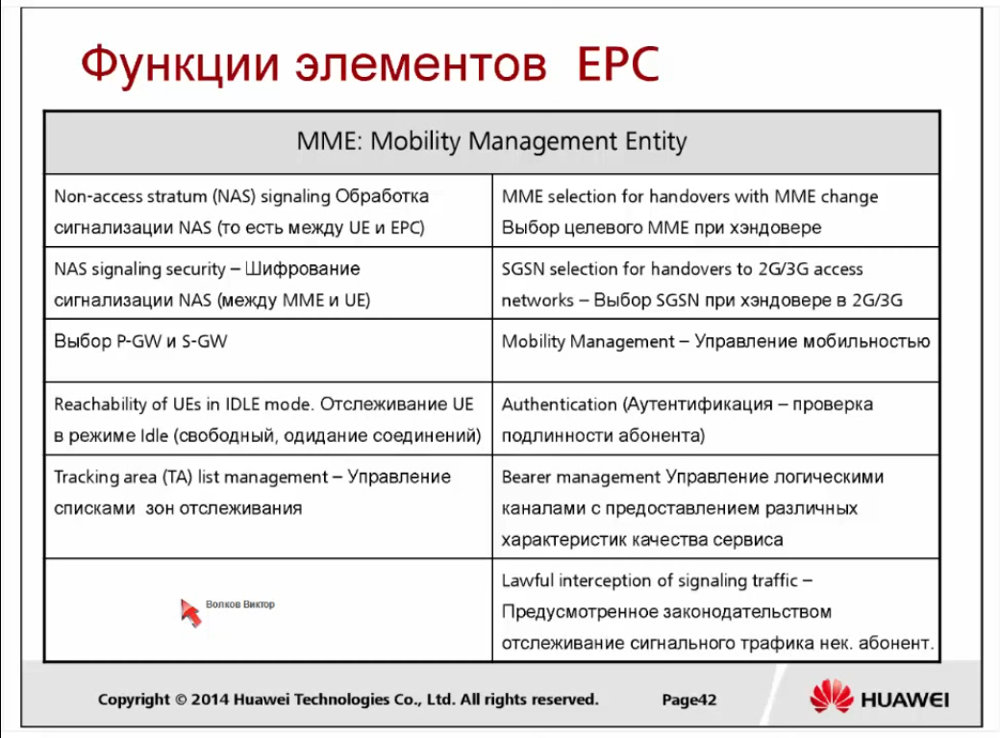

**Функции S-GW**

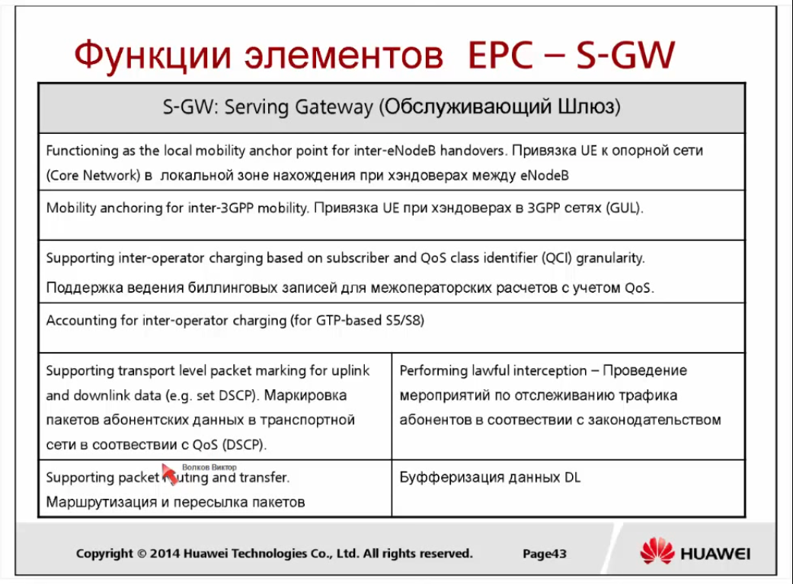

**Функции P-GW**

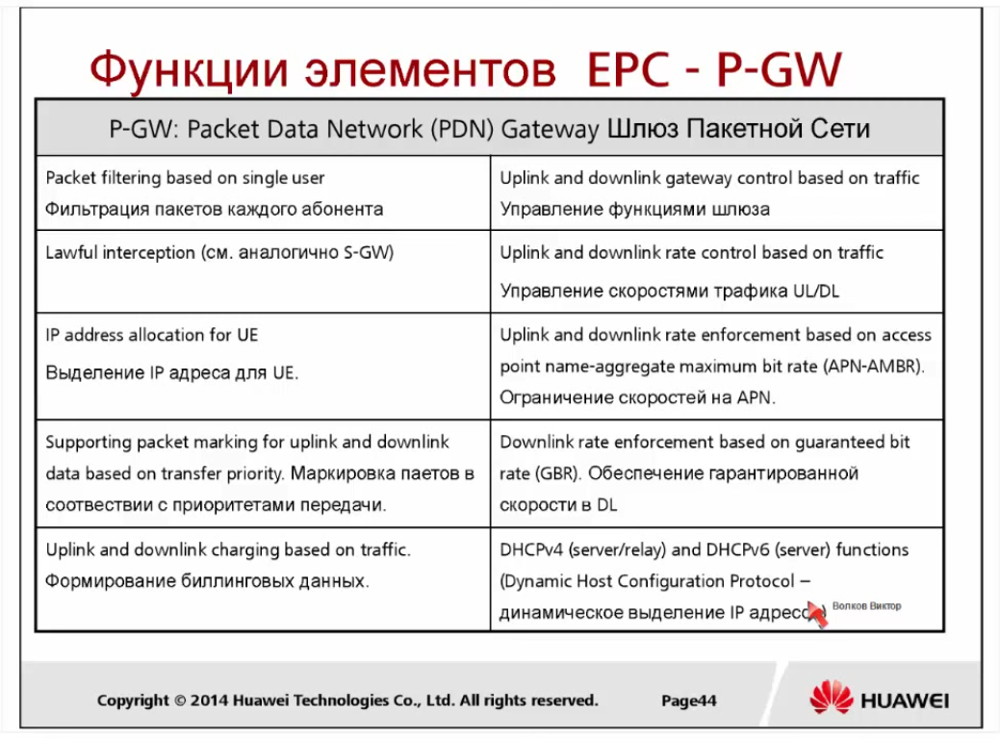

**Функции HSS**

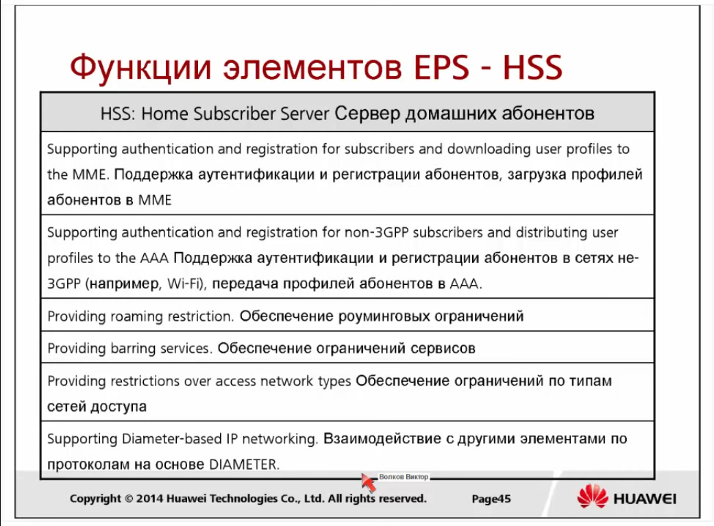

**Функции PCRF**

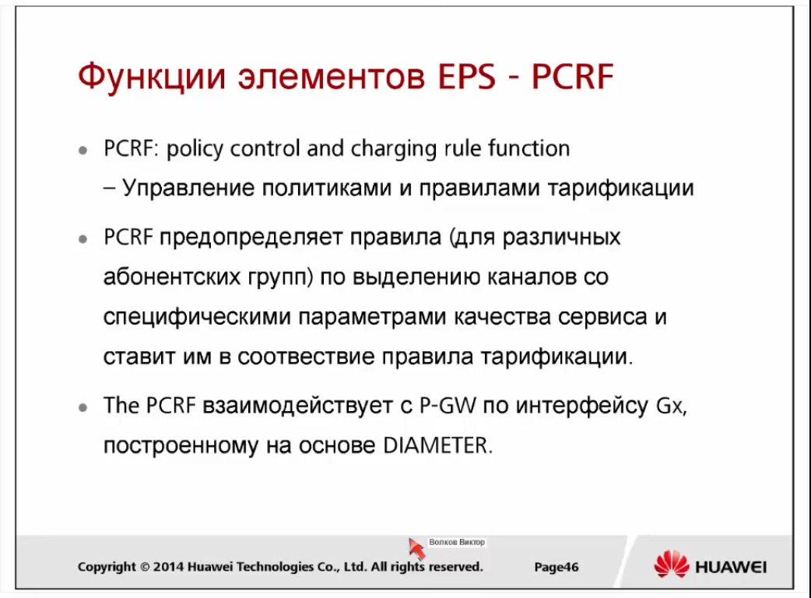

### Голосовой домен в LTE

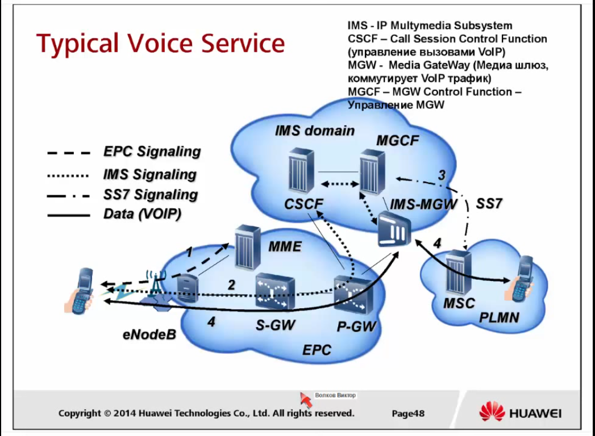

Передача голоса в LTE возможно только поверх ip. Для этого в LTE существует **IMS domain**.

### Роуминг в LTE

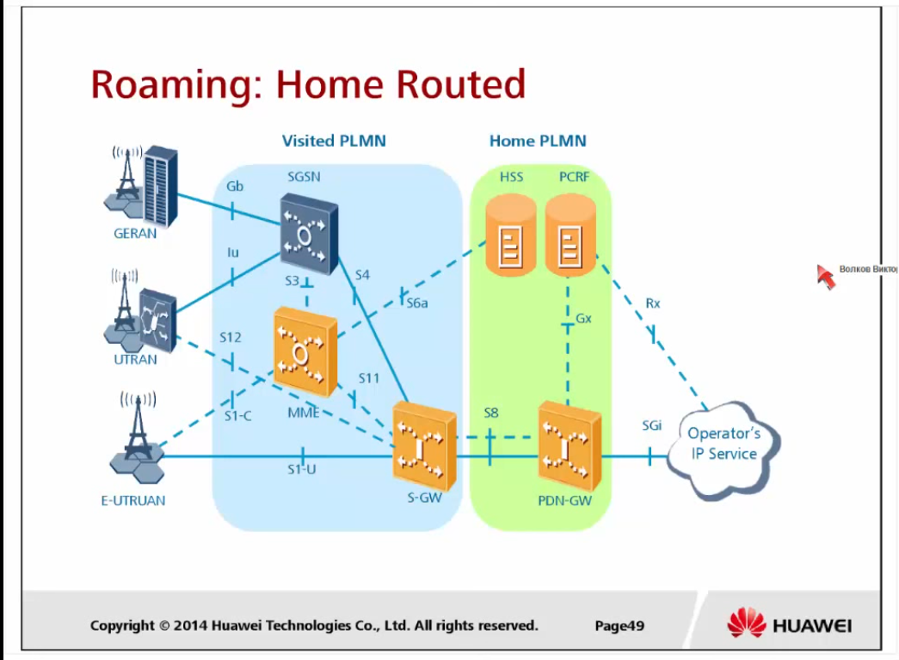

Интерейс между S-GW и P-GW обозначается как интерфейс S8 (а не S5), когда S-GW и P-GW находятся в разных сетях.

### Стек протоколов E-UTRAN

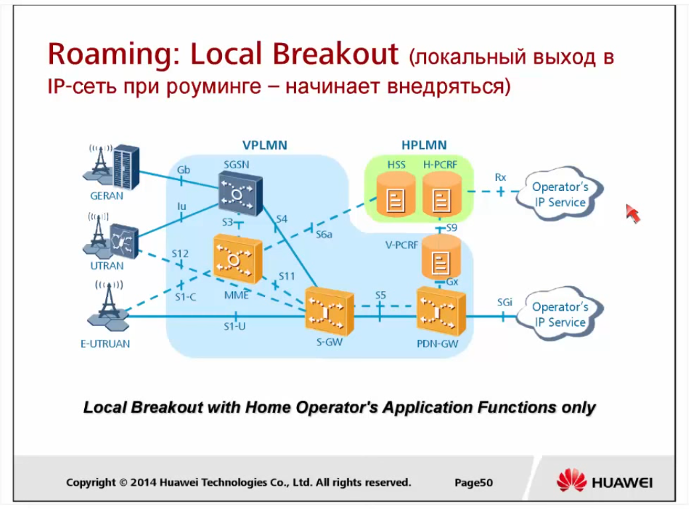

### Протокол Diameter

Это развитие протокола Radius. Использует AVP (Attribute Value Pairs - пары аттрибут-значение)

3 роли узлов:

1. Клиент - запрашивает сервер

2. Сервер - отвечает клиенту

3. Агент - перенаправляют запросы от клиента сервера и обратно

## Вопросы для самопроверки

- Which release of the 3GPP specifications includes the initial release of LTE?

  - Release 6
  - Release 7
  - Release 8
  - Release 9

- Which network elements form parts of the EPC?

   - UE
   - eNB
   - MME
   - S-GW
   - PDN-GW
   - HSS

- Which interface links the eNB to the MME?

    - Uu
    - S1
    - X2
    - S5

[Ссылка на вебинар](https://www.youtube.com/watch?v=dEXsLV_LvL4&t)

