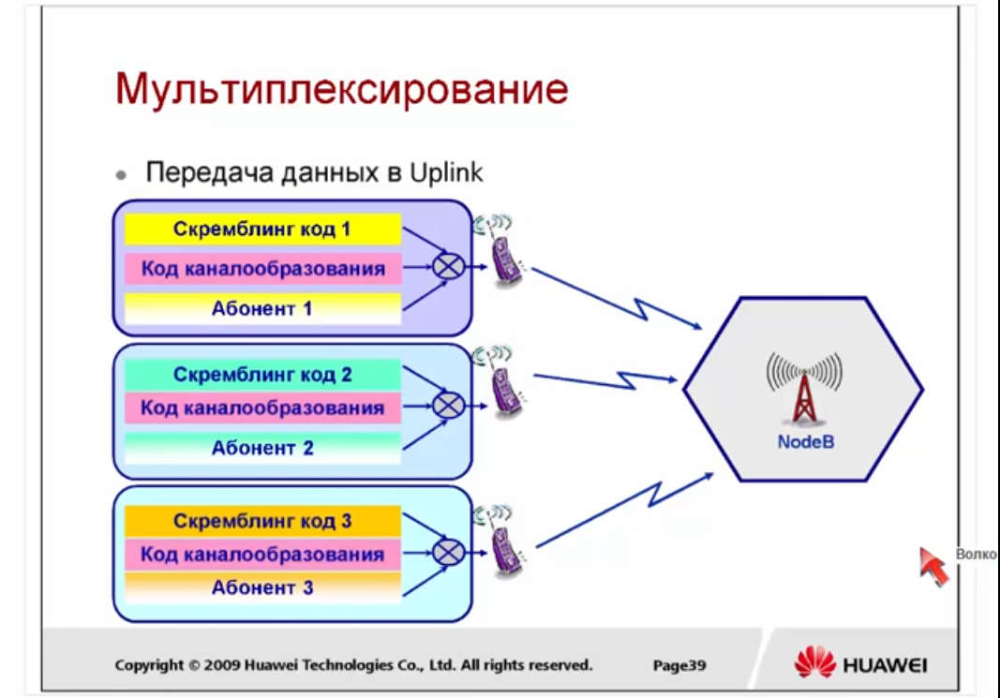
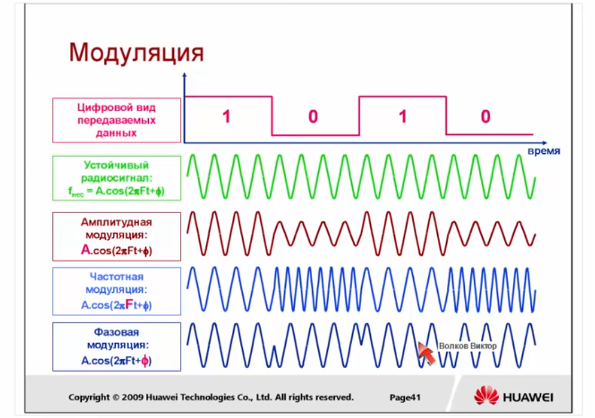
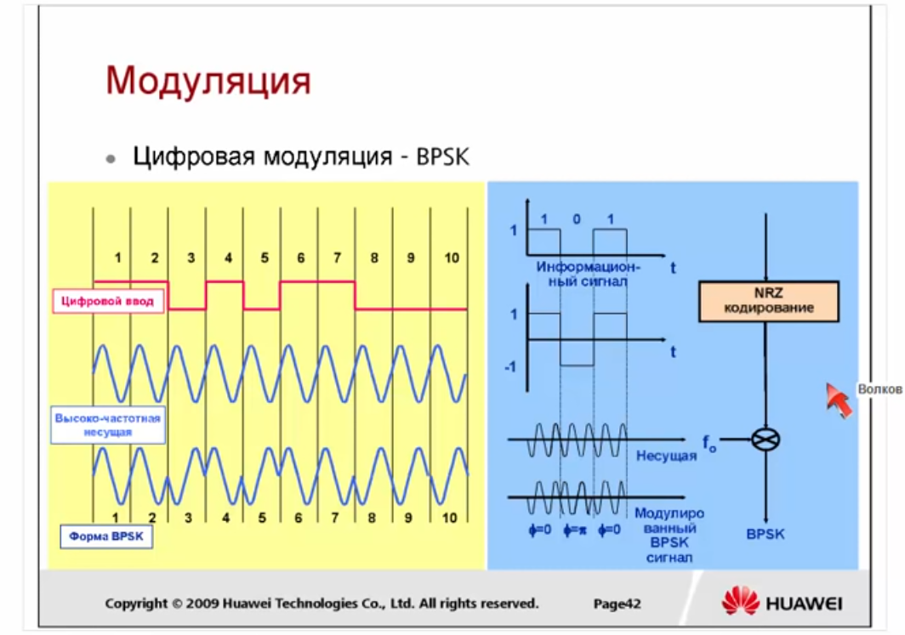
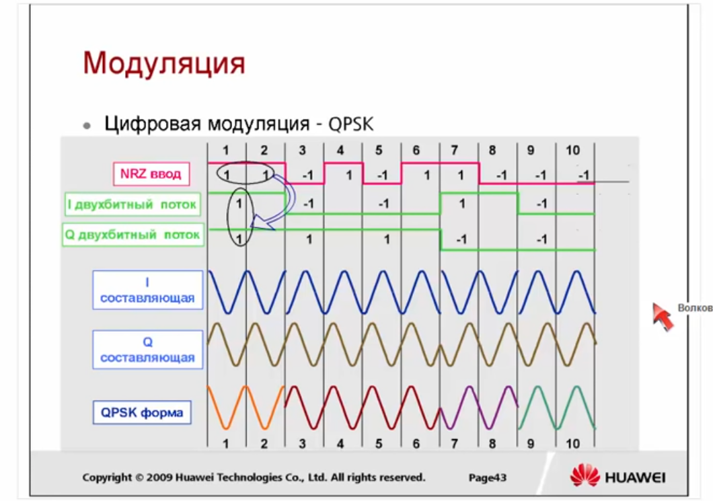
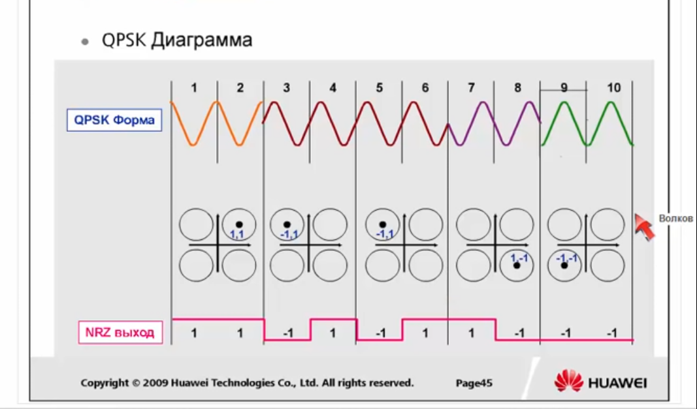
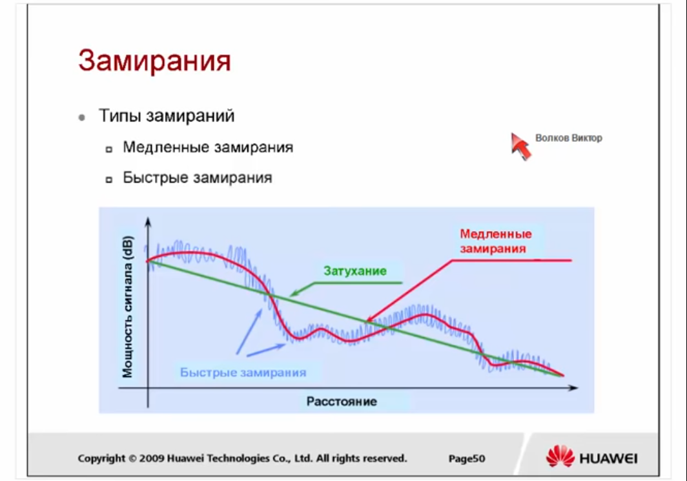
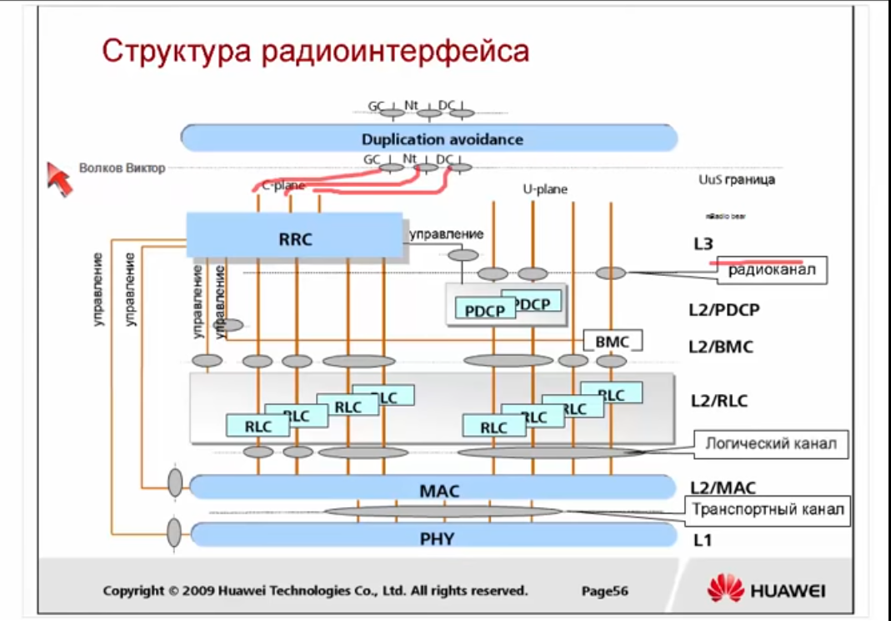
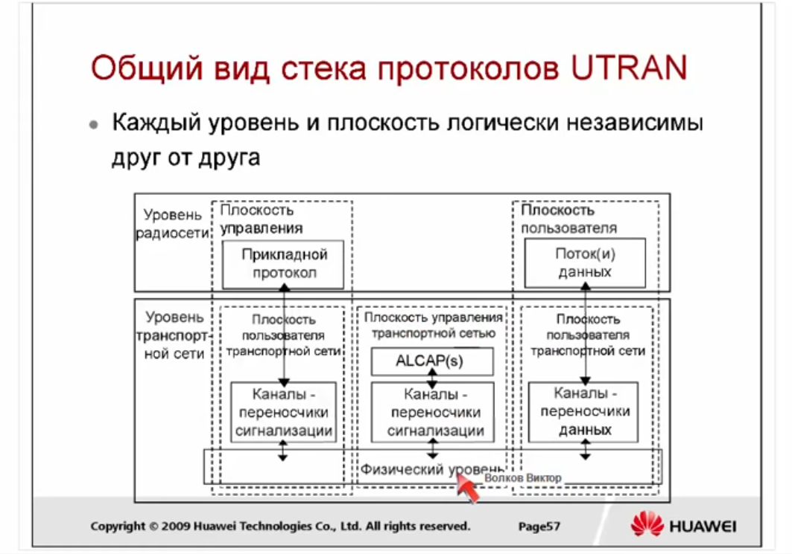
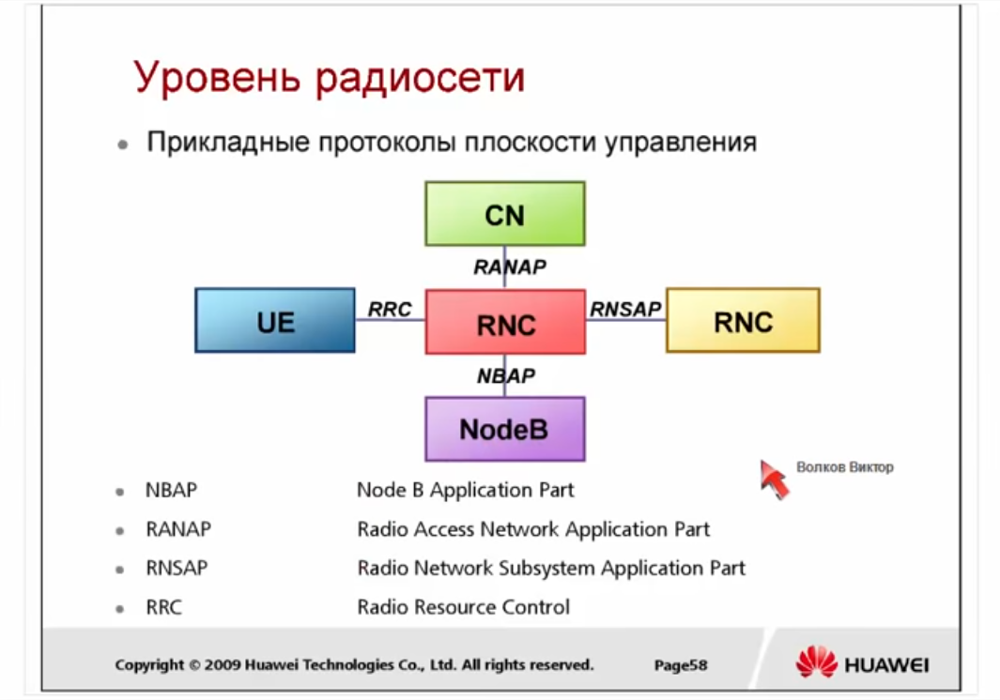

# WCDMA RAN

## Обзор 3G

Когда делался проект 3G сетей, то подразумевалось, что будут достинуты **следующие скорости**:

  - 144 kbps - mobile (для мобильных абонентов находящихся в транспорте)

  - 384 kbps - walking (для медлено движущегося абонента)

  - 2 mbps - static (для статического абонента)

После появления технологий HSDPA и HSUPA эти скорости были привышены.

**IMT-2000** - это общее наименование систем мобильной связи третьего поколения

Впервые сети 3G были представлены в 1985 году. В 1996 были переименованы в IMT-2000. А ввведены в коммерческую эксплуатацию в начале 2000-х. 

Рабочая частота около 2000 Мгц. В разных странах были выделены различные частоты.

Основная полоса:

  - 1920 ~ 1980 МГц 

  - 2110 ~ 2170 МГц

Дополнительные полосы используемые в некоторых странах:

  - 1850 ~ 1910 МГц / 1930 МГц ~ 1990 МГц (США)

  - 1710 ~ 1785 МГц / 1805 ~ 1880 МГц (Япония)

  - 890 ~ 915 МГц / 935 ~ 960 МГц (Австралия)

 Номер частотного канала = центральная частота x 5

   - Номера частотных каналов UL: 9612 ~ 9888
   - Номера частотных каналов DL: 10562 ~ 10838

### Классы качества сервиса

В 3G впервые стали говорить о сервисах различного уровня качества. 

Типы качества сервиса:

 - Разговорный (Conversational)
 - Потоковый (Streaming)
 - Интерактивный (Interactive)
 - Фоновый (Background)

*Приоритет сверху - вниз. Приоритет определяет, что сервис должен передаваться с минимальной задержкой*

### История развития 3G

Ядром технологий 3G является CDMA.

Разработкой технологий 3G занимались 3 различные группы:

  - 3GPP разрабатывала **WCDMA** на основе MAP (протокол стека SS7) и GPRS

  - Qualcomm разрабатывала **cdma2000** на основе ANSI 41 (во многом похож на MAP) и MIP (Mobile IP). В России cdma2000 использует немного компаний, в частности SkyLink. cdma2000 больше всего распространен в Америке и поддерживается 3GPP2.

  - **TD-SCDMA** развивалось в Азии различными компаниями, которые в последствии влились в 3GPP.

## Принципы технологии CDMA

### Технологии множественного доступа

### Технологии дуплексного разнесения

Технологии дуплексного разнесения:

  - Дуплексное разнесение по частоте (FDD - Frequency Division Duplex) - UpLink и DownLink это две разные частоты

  - Дуплексное разнесение по времени (TDD - Time Division Duplex) - на одной частоте используются разные промежутки времени для UpLink и DownLink

В WCDMA могут использоваться обе технологии, но как правило в Европе и России по умолчанию используется FDD.

## Архитектура сети WCDMA и стек протоколов

### Архитектура WCDMA

### Этапы развития сети WCDMA

## Радиоинтерфейс технологии WCDMA

### Кодирование сигнала

Между этапами **кодирование источника** и **канальное кодирование и перемежение** происходит кодирование блока CRC. **CRC (cyclic redundancy check)** - схема определения ошибок передачи данных, использующая в кодировании блока. Но в GPRS, UMTS, LTE не используется для исправления ошибок, а только для их фиксации. Если сервис Non-realtime, то некорректный блок может быть перезапрошен, если realtime, то может быть отмечен как некоректный и передан дальше.

### Кодирование канала (канальное кодирование и перемежение)

Схема кодирования назначается, тогда, когда назначается канал.

Перемежение используется для снижения действия эффекта интерференции *(см. пункт о передаче сигнала)*

### Расширение (Spreading)

*Принцип CDMA заключается в том, что каждому источнику информации назначается индивидуальный код, при помощи которого он кодирует передаваемое сообщение. Приемник информации также знает этот код и его задача в том, чтобы выделить закодированное сообщение нужного отправителя из всего потока других сообщений.*

*На математическом языке свойство "похожести" называется корреляцией. Таким образом, закодированные сообщения должны обладать как можно меньшей корреляцией. Этим свойством обладают ортогональные коды, взаимное скалярное произведение которых равно 0. На практике удается получить не полностью ортогональные коды, а почти ортогональные.*

*Главным отличием WCDMA от CDMA является дополнительная операция, проводимая до передачи сигнала в эфир – расширение.*

В процессе расширения на узкополосный сигнал накладывается код расширения и сигнал становится широкополосный. (чем длинее код расширения, тем больше частот занимает сигнал, т.е. ограничение на усиление сигнала - это длина полосы) В процессе передачи на него накладывается шум.

Для каждого сервиса существует требование Eb / No, т.е. на сколько сигнал должен превышать шум после обработки. При этом учитывается, что сигнал был **усилен в кол-во раз соответствующей длине расширяющей последовательности**.

**Технология расширения**, состоит из двух этапов:

1. **Каналообразование** - преобразование символов в чипы

2. **Скемблинг** - шумоподобное кодирование расширенного сигнала

Когда абоненты находятся на разных расстояних от базовой станции, то сигнал смещен по времени друг от друга и ортоганальные сигналы теряют свое свойство (*это значит, что в UpLink канале впринципе нельзя использовать ортоганальное расширение*), поэтому излучение каждого источника представляется как шумоподобный сигнал, для этого используется **скремблирование**.

**Коды каналообразования OVSF коды:**

Spread Factor 1 по умолчанию = 1. Spread Factor 2 один из них это двухкратное повторение SF1, а второй это код и код взятый с минусом. Код SF4, это два раза повторили предыдущий порядок; один раз повторили предыдущий порядок, но вторая часть с минусом. Если идти подобным путем, то можно доказать, что коды на любой ступени будут являтся ортоганальными.

**Назначение кодов каналообразования:** 

1. В DownLink, коды каналообразования (OVSF коды) использутся для разделения физических каналов в одной соте (разделение абонентов)

2. В UpLink, коды каналообразования (OVSF коды) используются для разделения физических каналов одного абоента (разделения сервисов одного абонента)

**Назначение скремблинг кодов:**

1. В DownLink, скремблинг коды используются для разделения сот, работающих на одной частоте

2. В UpLink, скремблинг коды используются для разделения абонентов, работающих на одной частоте 

**Скремблинг коды (PSC - Primary Scrambling code):**

Primary Scrambling Codes (первые 512 кодов) делятся на 64 группы, каждая группа состоит из 8ми первичных скремблинг кодов.

*Secondary Scrambling Codes используются при использовании MIMO*

**Мультиплексирование в Downlink:**

**Мультиплексирование в Uplink:**

### Модуляция ###

В классическом WCDMA используется фазовая модуляция (точнее манипуляция)

**Двоичная фазовая манипуляция (BPSK — binary phase-shift keying)** - фаза сигнала изменяется на 180 градусов

**Квадратурной фазовой манипуляции (QPSK — Quadrature Phase Shift Keying или 4-PSK)** - чипы делятся на два потока. Четные чипы модулируют косинус, а нечетные синус.

В HSPA используется модуляция 16QAM, в которой меняется не только значение фазы, но и значения амплитуды.

### Передача сигнала

Сигнал, который был принят приемником сильно отличается по амплитуде от сигнала, который был отправлен. Потери амплитуды происходят из-за затухания сигнала и замирания.

При удалении абонента от соты сигнал затухает.

**Быстрые замирания** - обусловлены интерференцией отраженных лучей

**Медленные замирания** - обусловлены зонами радио тени

Для борьбы с замираниями используются **технологии разнесения**. 

**Типы разнесений:**

1. **Временное разнесение** - при **канальном кодировании** в дополнение к внесению избыточности используется перемежение. 

2. **Частотное разнесение** - пользовательский сигнал распределен на всей полосе частотного спектра

3. **Пространственное разнесение** - используя RAKE приемник (грабли) помогает бороться с быстрыми замираниями, вызванными многолучевым распространением волн

4. **Поляризационное разнесение**

## Интерфейсы сети UTRAN ##

### Структура радиоинтерфейса ###

Структура радиоинтерфейса разделяется на две части:

1. User Plane (справа на картинке)

2. Control Plane (слева на картинке)

Из Core Network приходят три типа сигнальных сообщений:

1. GC, General Control (Общее управление) - отвечат за переустановку\переконфигурацию наземных интерфейсов с Core Network

2. DC, Dedicated Control - сигнальные сообщение по отношению к конкретной абонентской станции

3. Nt, Notification - уведомления абонентов (напрмер о вызове или пейдженге)

Эти сообщения приходят на блок RRC (Radio Resource Control). RRC с точки зрения модели OSI работает на уровне 3. *Также на 3-ем уровне работает ряд процессов относящиеся к Core Network, Non-access stratum'у, которые на данном рисунке не показаны.*

Также на RRC приходят сигнальные сообщения от абонентов и блок RRC осуществляет выработку команд для настроек всех других уровней (MAC, PHY).

Радиоинтерфейс выполняется как на контроллере, так и на базовой станции. В UMTS, RRC выполняет контроллер, на контроллере функции RRC выполняет сингнальный процессор. Функции обработки второго уровня (PDCP, RLC и частично MAC) на контроллере выполняют платы Data Proccessing'а. Уровень MAC относящийся к релизу 99 полностью выполняется на стороне RRC, а обработка MAC уровня каналов относящихся к технологиям HSPA частично выполняется на NodeB.

Соединение между RRC и User Equipment на Layer 2 называется **Radio Bear**. *(на рисунке написано "радиоканал", но лучше это слово не переводить)*

Radio Bear также может быть Signaling Radio Bear (в левой части рисунка) и Traffic Radio Bear (в правой части рисунка).

Из RRC выходят 4 типа логических каналов (radio bear), которые существуют в Control Plane. Это:

1. Broadcast Control Channel

2. Command Control Channel

3. Paging Control Channel

4. Dedicated Control Channel

В User Plane тоже 4 типа radio bear, которые по сути соответствуют 4'ем классам качества сервиса.

Направляющая (на картинке), которая идет от RRC на уровень RLC без предварительной обработки - это голос (conversational service). Обработка этого сервиса полностью подготавливается элементами Non-Access Stratum'ом.

Сервисы Interactive и Background, в этих сервисах блоки приходят произвольной длины (по сути это ip пакеты) и модуль **PDCP (Packet Data Convergational Protocol)** нарезает эти пакеты в соотвествии с возможностями радиоинтерфейса (в классическом WCDMA это блоки 336 бит или 650 бит). Также PDCP может заменять заголовки пакетов tcp\ip на более короткие, для одинаковых источников пакетов.

Сервис Streaming приходит на модуль **BMC (Broadcast Multicast Control)**. Этот блок управляет передачей сервиса на те или иные базовые станции.

Все сервисы попадают на уровень **RLC (Radio Link Control)**. Задача уровня RLC добавить к каждому пакету контрольную сумму и обработать в соответствии с режимом обработки. 

**Режимы обработки на уровне RLC:**

1. **Transparent** - контрольная сумма используется только для фиксации ошибок в пакете. Часто применяется к голосовому сервису и к сигнальным сообщениям.

2. **Unacknowledge mode** - режим без подтверждения. Применяется к трафики реального времени (streaming & conversational). Битые пакеты просто отбрасываются.

3. **Acknowledge mode** - применяется к трафику Interactive & Background (т.е. где не критично время передачи). Передающая сторона каждый пакет трафика копирует к себе в буфер и передает. В случае если приемная сторона корректно определят CRC, на передающую сторону передается Acknowledge и передающая сторона удаляет пакет из буфера. Если приемная сторона примает пакет с ошибкой, то посылается NotAcknoweledge и данные передаются повторно.

**Логический канал** - это информация нарезанная на блоки с контрольной суммой в соответствии с требованием радиоинтерфейса.

На уровне **MAC** блоки пришедшие с RLC мультиплексируют User Plane и Control Plane в единые **транспортные каналы**. Вторая функция MAC уровня - нарезать данные на блоки в соответствии с физическим уровнем радиоинтерфейса.

В HSPA уровень MAC выполняет дополнительные функции - планирование очереди и процессы гибридного ARQ.

### Общий вид стека протоколов UTRAN

Плоскость управления транспортной сетью (ALCAP) используется в сетях ATM, с появлением IP перестала использоваться.

### Уровень радиосети (Radio Network Layer)

