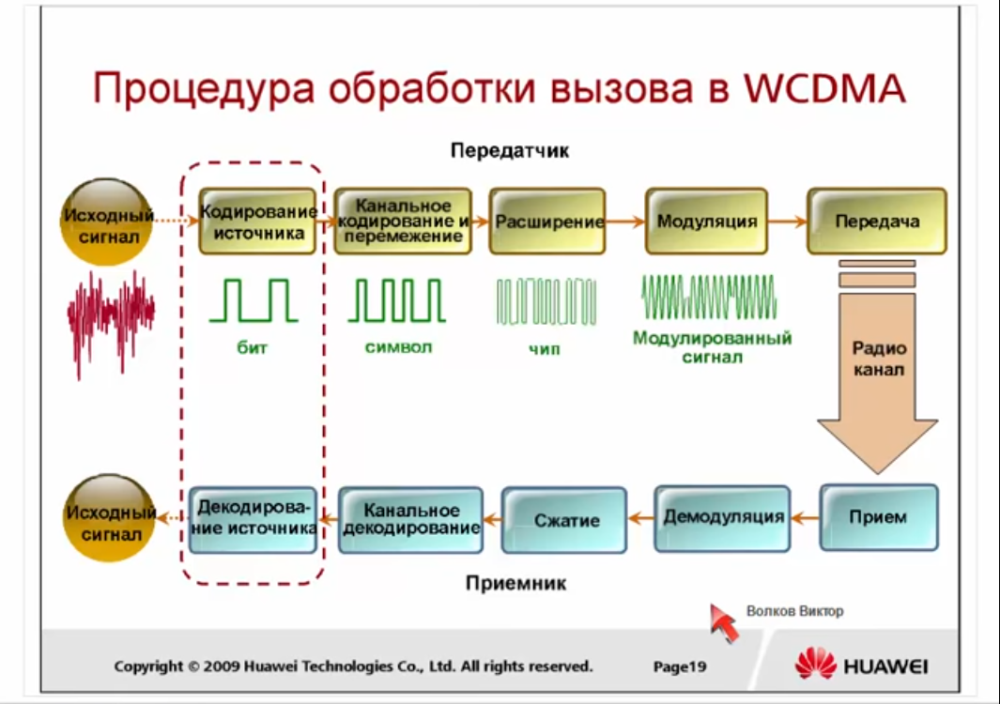
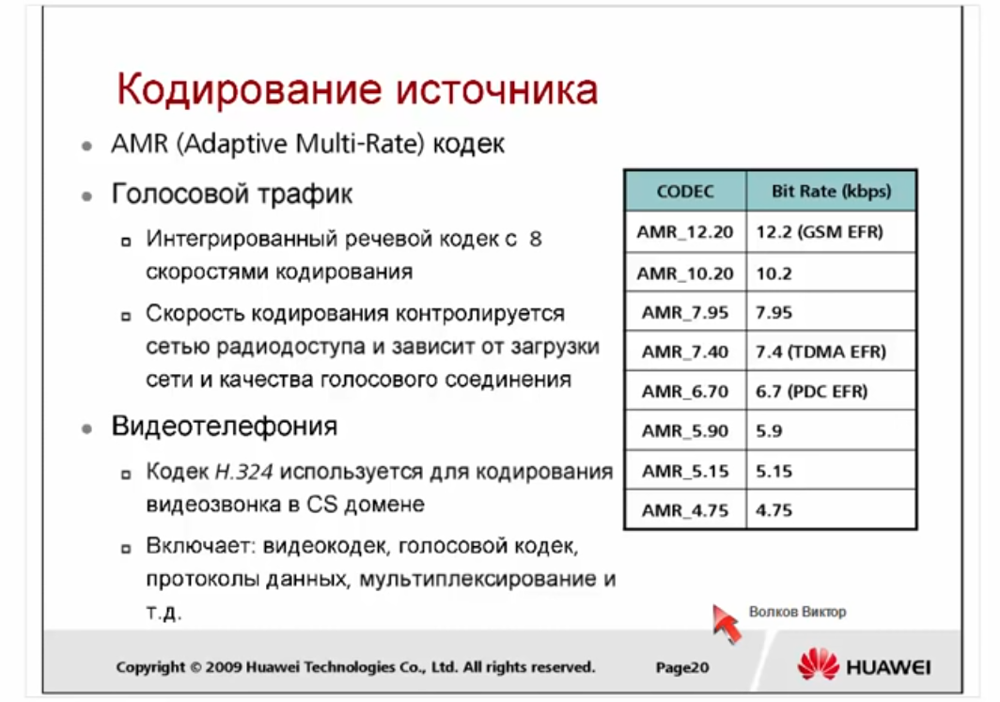
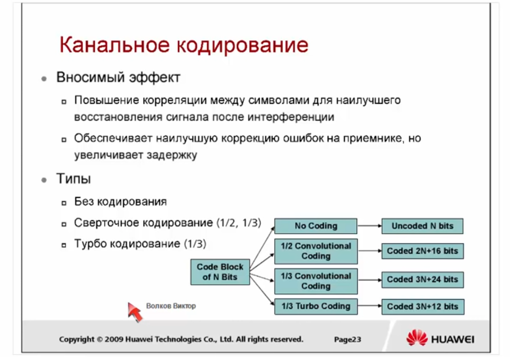
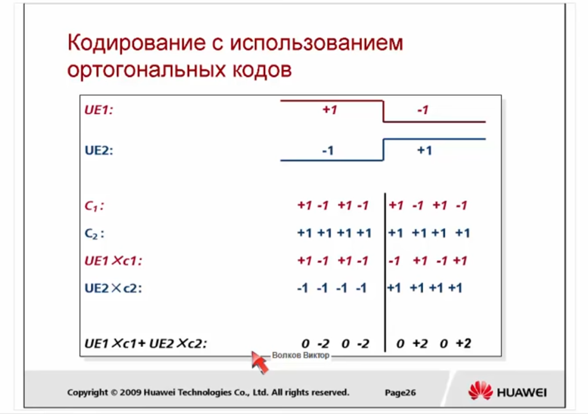
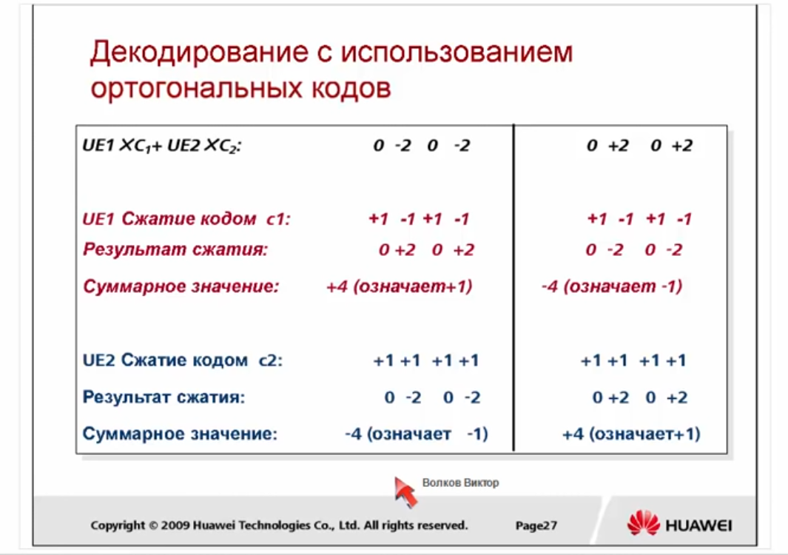
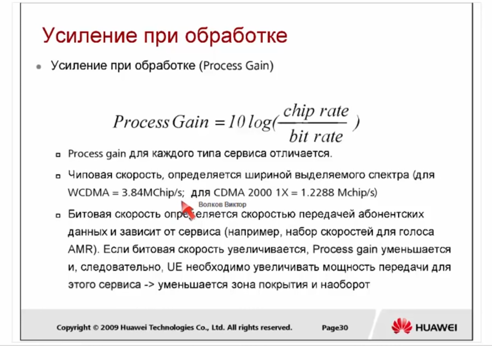
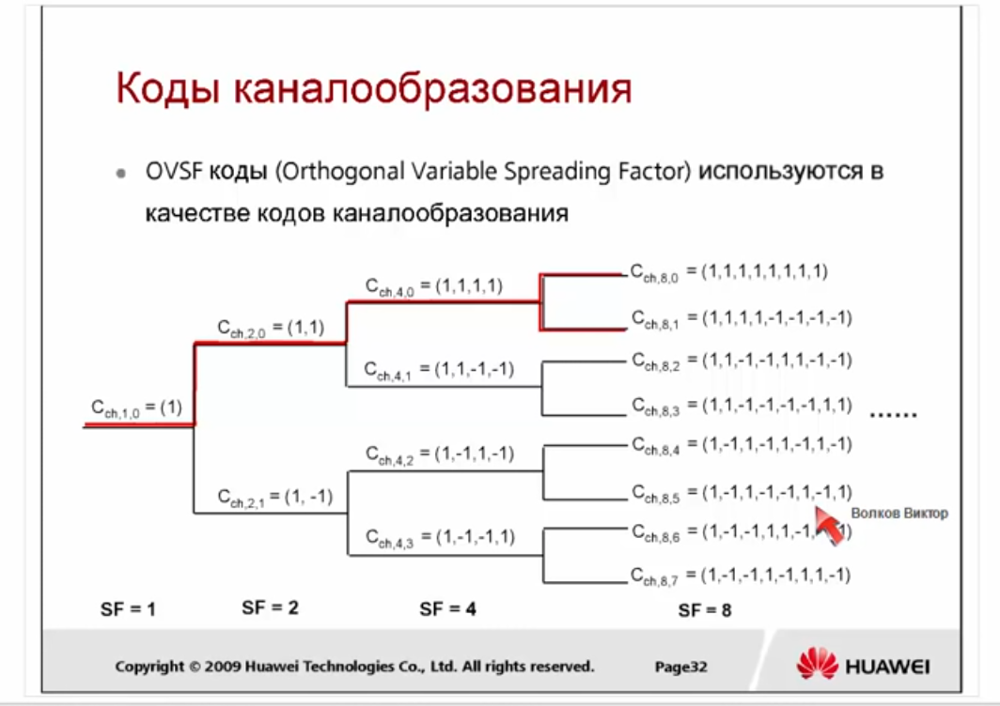
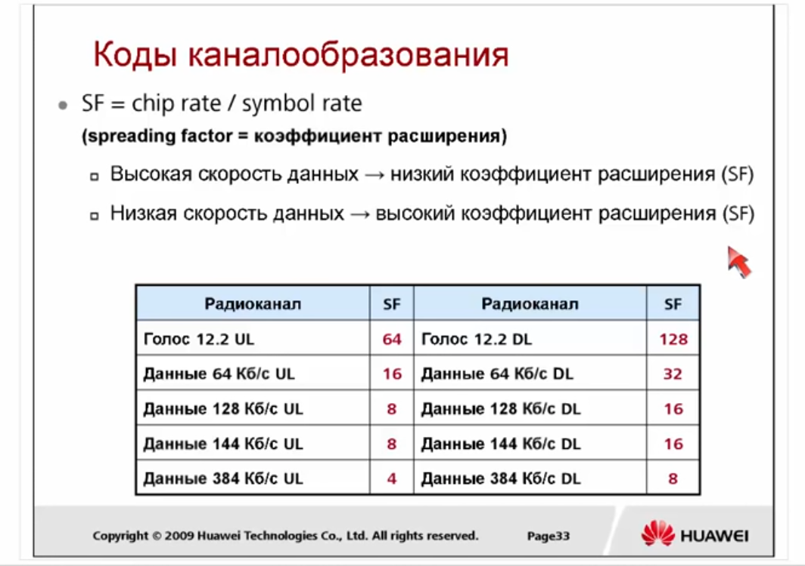
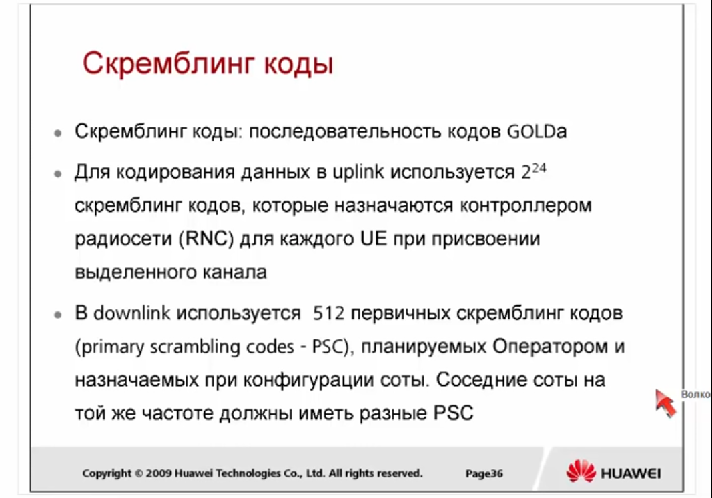
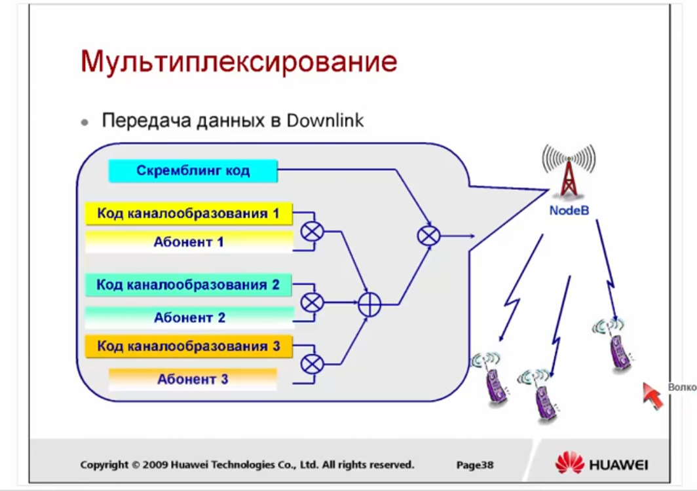

# WCDMA RAN

## Обзор 3G

Когда делался проект 3G сетей, то подразумевалось, что будут достинуты **следующие скорости**:

  - 144 kbps - mobile (для мобильных абонентов находящихся в транспорте)

  - 384 kbps - walking (для медлено движущегося абонента)

  - 2 mbps - static (для статического абонента)

После появления технологий HSDPA и HSUPA эти скорости были привышены.

**IMT-2000** - это общее наименование систем мобильной связи третьего поколения

Впервые сети 3G были представлены в 1985 году. В 1996 были переименованы в IMT-2000. А ввведены в коммерческую эксплуатацию в начале 2000-х. 

Рабочая частота около 2000 Мгц. В разных странах были выделены различные частоты.

Основная полоса:

  - 1920 ~ 1980 МГц 

  - 2110 ~ 2170 МГц

Дополнительные полосы используемые в некоторых странах:

  - 1850 ~ 1910 МГц / 1930 МГц ~ 1990 МГц (США)

  - 1710 ~ 1785 МГц / 1805 ~ 1880 МГц (Япония)

  - 890 ~ 915 МГц / 935 ~ 960 МГц (Австралия)

 Номер частотного канала = центральная частота x 5

   - Номера частотных каналов UL: 9612 ~ 9888
   - Номера частотных каналов DL: 10562 ~ 10838

### Классы качества сервиса

В 3G впервые стали говорить о сервисах различного уровня качества. 

Типы качества сервиса:

 - Разговорный (Conversational)
 - Потоковый (Streaming)
 - Интерактивный (Interactive)
 - Фоновый (Background)

*Приоритет сверху - вниз. Приоритет определяет, что сервис должен передаваться с минимальной задержкой*

### История развития 3G

Ядром технологий 3G является CDMA.

Разработкой технологий 3G занимались 3 различные группы:

  - 3GPP разрабатывала **WCDMA** на основе MAP (протокол стека SS7) и GPRS

  - Qualcomm разрабатывала **cdma2000** на основе ANSI 41 (во многом похож на MAP) и MIP (Mobile IP). В России cdma2000 использует немного компаний, в частности SkyLink. cdma2000 больше всего распространен в Америке и поддерживается 3GPP2.

  - **TD-SCDMA** развивалось в Азии различными компаниями, которые в последствии влились в 3GPP.

## Принципы технологии CDMA

### Технологии множественного доступа

### Технологии дуплексного разнесения

Технологии дуплексного разнесения:

  - Дуплексное разнесение по частоте (FDD - Frequency Division Duplex) - UpLink и DownLink это две разные частоты

  - Дуплексное разнесение по времени (TDD - Time Division Duplex) - на одной частоте используются разные промежутки времени для UpLink и DownLink

В WCDMA могут использоваться обе технологии, но как правило в Европе и России по умолчанию используется FDD.

## Архитектура сети WCDMA и стек протоколов

### Архитектура WCDMA

### Этапы развития сети WCDMA

## Радиоинтерфейс технологии WCDMA

### Кодирование сигнала

Между этапами **кодирование источника** и **канальное кодирование и перемежение** происходит кодирование блока CRC. **CRC (cyclic redundancy check)** - схема определения ошибок передачи данных, использующая в кодировании блока. Но в GPRS, UMTS, LTE не используется для исправления ошибок, а только для их фиксации. Если сервис Non-realtime, то некорректный блок может быть перезапрошен, если realtime, то может быть отмечен как некоректный и передан дальше.

### Кодирование канала (канальное кодирование и перемежение)

Схема кодирования назначается, тогда, когда назначается канал.

### Расширение (Spreading)

*Принцип CDMA заключается в том, что каждому источнику информации назначается индивидуальный код, при помощи которого он кодирует передаваемое сообщение. Приемник информации также знает этот код и его задача в том, чтобы выделить закодированное сообщение нужного отправителя из всего потока других сообщений.*

*На математическом языке свойство "похожести" называется корреляцией. Таким образом, закодированные сообщения должны обладать как можно меньшей корреляцией. Этим свойством обладают ортогональные коды, взаимное скалярное произведение которых равно 0. На практике удается получить не полностью ортогональные коды, а почти ортогональные.*

*Главным отличием WCDMA от CDMA является дополнительная операция, проводимая до передачи сигнала в эфир – расширение.*

*PS мне непонятно, как после того как получаем скалярное произведение бита и ортоганального кода это произведение передается дальше. Т.е. как физически можно передать вместо бита значения 0 -2 0 -2 ????*

В процессе расширения на узкополосный сигнал накладывается код расширения и сигнал становится широкополосный. (чем длинее код расширения, тем больше частот занимает сигнал, т.е. ограничение на усиление сигнала - это длина полосы) В процессе передачи на него накладывается шум.

Для каждого сервиса существует требование Eb / No, т.е. на сколько сигнал должен превышать шум после обработки. При этом учитывается, что сигнал был **усилен в кол-во раз соответствующей длиней расширяющей последовательности**.

**Технология расширения**, состоит из двух этапов:

1. **Каналообразование** - преобразование символов в чипы

2. **Скемблинг** - шумоподобное кодирование расширенного сигнала

Когда абоненты находятся на разных расстояних от базовой станции, то сигнал смещен по времени друг от друга и ортоганальные сигналы теряют свое свойство (*это значит, что в UpLink канале впринципе нельзя использовать ортоганальное расширение*), поэтому излучение каждого источника представляется как шумоподобный сигнал, для этого используется **скремблирование**.

**Коды каналообразования OVSF коды:**

Spread Factor 1 по умолчанию = 1. Spread Factor 2 один из них это двухкратное повторение SF1, а второй это код и код взятый с минусом. Код SF4, это два раза повторили предыдущий порядок; один раз повторили предыдущий порядок, но вторая часть с минусом. Если идти подобным путем, то можно доказать, что коды на любой ступени будут являтся ортоганальными.

**Назначение кодов каналообразования:** 

1. В DownLink, коды каналообразования (OVSF коды) использутся для разделения физических каналов в одной соте (разделение абонентов)

2. В UpLink, коды каналообразования (OVSF коды) используются для разделения физических каналов одного абоента (разделения сервисов одного абонента)

**Назначение скремблинг кодов:**

1. В DownLink, скремблинг коды используются для разделения сот, работающих на одной частоте

2. В UpLink, скремблинг коды используются для разделения абонентов, работающих на одной частоте 

**Скремблинг коды (PSC - Primary Scrambling code):**

Primary Scrambling Codes (первые 512 кодов) делятся на 64 группы, каждая группа состоит из 8ми первичных скремблинг кодов.

*Secondary Scrambling Codes используются при использовании MIMO*

**Мультиплексирование в Downlink:**

