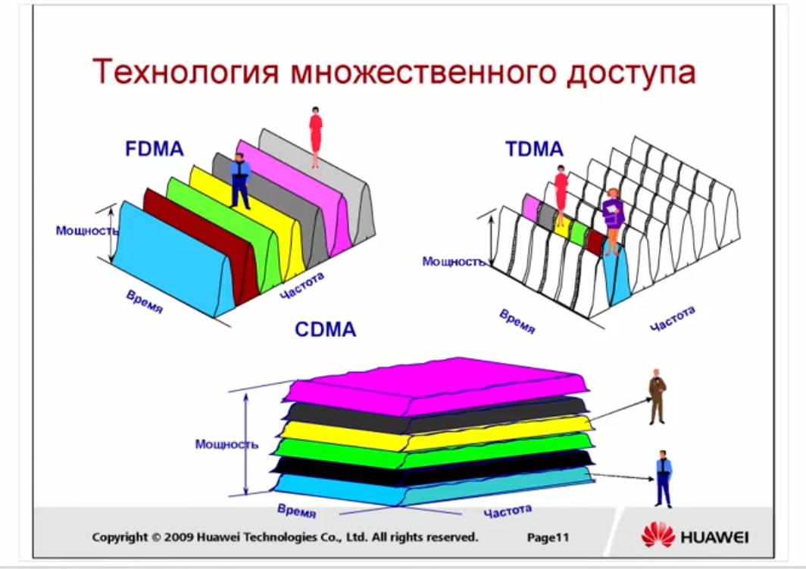
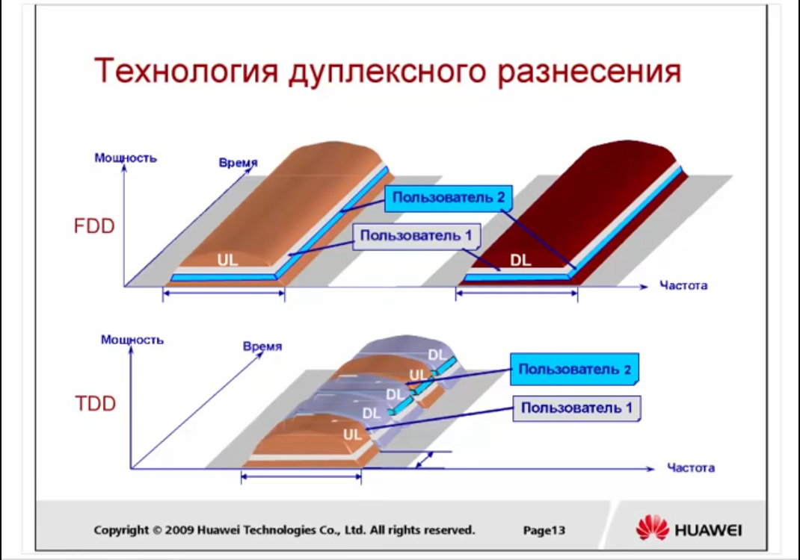
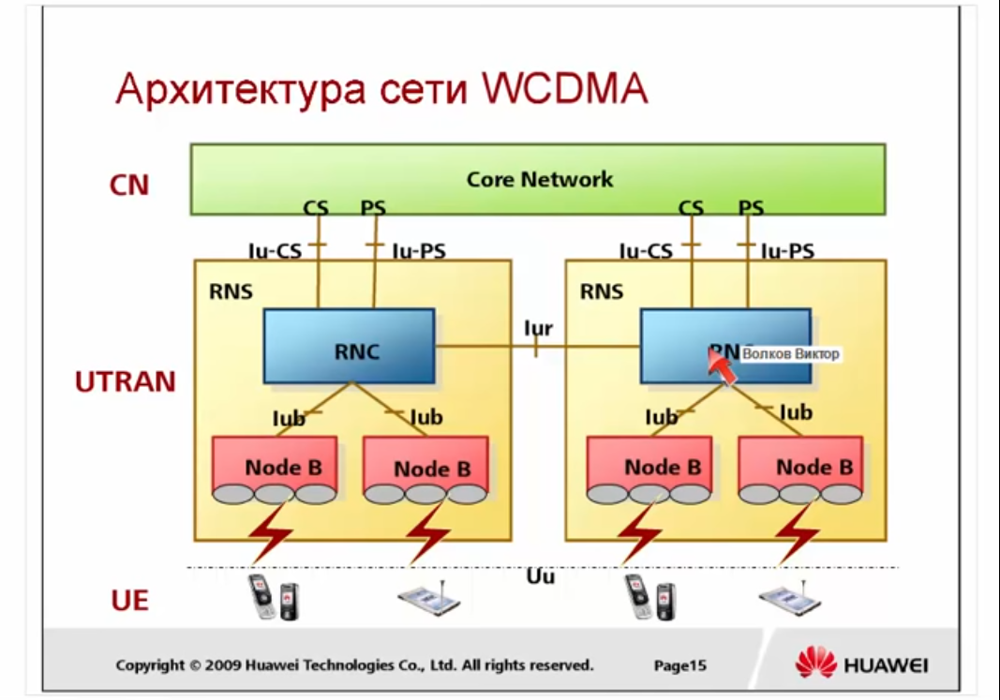
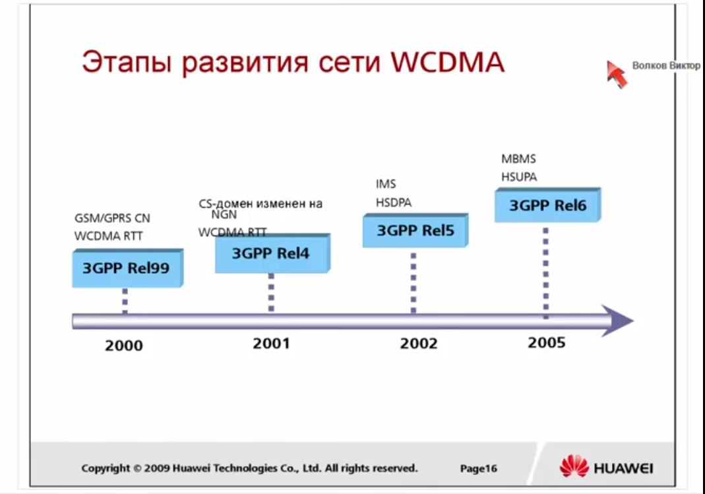
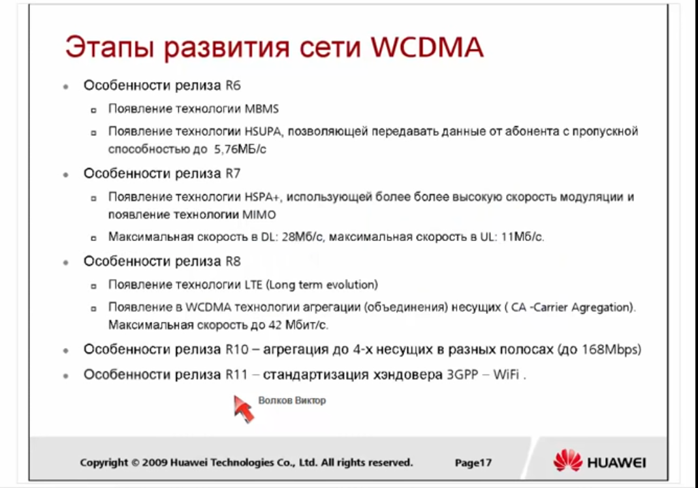

# WCDMA RAN

## Обзор 3G

Когда делался проект 3G сетей, то подразумевалось, что будут достинуты **следующие скорости**:

  - 144 kbps - mobile (для мобильных абонентов находящихся в транспорте)

  - 384 kbps - walking (для медлено движущегося абонента)

  - 2 mbps - static (для статического абонента)

После появления технологий HSDPA и HSUPA эти скорости были привышены.

**IMT-2000** - это общее наименование систем мобильной связи третьего поколения

Впервые сети 3G были представлены в 1985 году. В 1996 были переименованы в IMT-2000. А ввведены в коммерческую эксплуатацию в начале 2000-х. 

Рабочая частота около 2000 Мгц. В разных странах были выделены различные частоты.

Основная полоса:

  - 1920 ~ 1980 МГц 

  - 2110 ~ 2170 МГц

Дополнительные полосы используемые в некоторых странах:

  - 1850 ~ 1910 МГц / 1930 МГц ~ 1990 МГц (США)

  - 1710 ~ 1785 МГц / 1805 ~ 1880 МГц (Япония)

  - 890 ~ 915 МГц / 935 ~ 960 МГц (Австралия)

 Номер частотного канала = центральная частота x 5

   - Номера частотных каналов UL: 9612 ~ 9888
   - Номера частотных каналов DL: 10562 ~ 10838

### Классы качества сервиса

В 3G впервые стали говорить о сервисах различного уровня качества. 

Типы качества сервиса:

 - Разговорный (Conversational)
 - Потоковый (Streaming)
 - Интерактивный (Interactive)
 - Фоновый (Background)

*Приоритет сверху - вниз. Приоритет определяет, что сервис должен передаваться с минимальной задержкой*

### История развития 3G

Ядром технологий 3G является CDMA.

Разработкой технологий 3G занимались 3 различные группы:

  - 3GPP разрабатывала **WCDMA** на основе MAP (протокол стека SS7) и GPRS

  - Qualcomm разрабатывала **cdma2000** на основе ANSI 41 (во многом похож на MAP) и MIP (Mobile IP). В России cdma2000 использует немного компаний, в частности SkyLink. cdma2000 больше всего распространен в Америке и поддерживается 3GPP2.

  - **TD-SCDMA** развивалось в Азии различными компаниями, которые в последствии влились в 3GPP.

## Принципы технологии CDMA

### Технологии множественного доступа

### Технологии дуплексного разнесения

Технологии дуплексного разнесения:

  - Дуплексное разнесение по частоте (FDD - Frequency Division Duplex) - UpLink и DownLink это две разные частоты

  - Дуплексное разнесение по времени (TDD - Time Division Duplex) - на одной частоте используются разные промежутки времени для UpLink и DownLink

В WCDMA могут использоваться обе технологии, но как правило в Европе и России по умолчанию используется FDD.

## Архитектура сети WCDMA и стек протоколов

### Архитектура WCDMA

### Этапы развития сети WCDMA

## Радиоинтерфейс технологии WCDMA