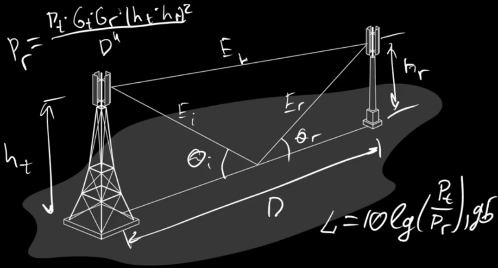
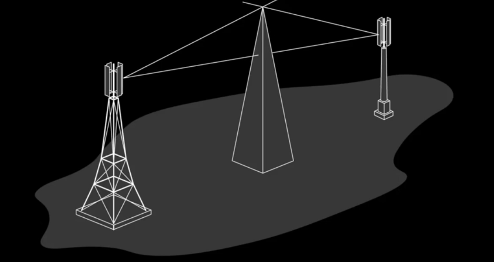
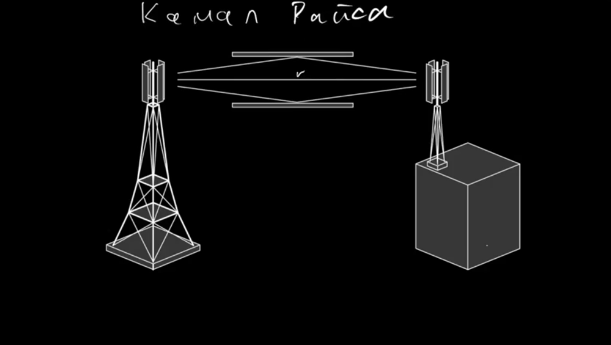

# Беспроводные телекоммуникационные системы

## Лекция 1. Модели каналов связи (11.01.2018)

**Обобщенная модель канала связи:**
1. Источник информации (микрофон, мобильное устройство)

2. Радиопередающее устройство - преобразует полученную от источника информации в электромагнитые волны и передает на базовую станцию, либо на ретронслятор

3. Второй ретранслятор к которому сигнал приходит через среду распространения от первого ретранслятора

4. Второе радиопередающее устройство - принимает через среду распространения от второго ретранслятора сигнал и преобразует электромагнитные волны в вид, который может обработать получатель

5. Получатель информации

**Модель распростанения волн в свободном пространстве** используется для расчет принятого сигнала при условии прямой видимости (без препятствий). Эта модель приняется для спутниковой связи и радиолиний сверхвысоких частот.

**Мощность принимаемого радиоприемника в данной модели:**

	Pr = (Pt * Gt * Gr * λ^2) / (4π * D)^2

	Pt - это мощность передатчика

	Gt - это коэф. усиления передающей антенны

	Gr - это коэф. усиления приемной антенны

	λ - это длина волны в свободном пространстве

	D - это расстояние между двумя антеннами

**Потери передачи:**

	L = 10lg(Pt / Pr), дБ
Данное соотношение верно, только если антенны находятся в **дальней зоне** от друг друга.

**Дальняя зона определяется:**

	r >= 2 * D^2 / λ 

	при этом r >> D и r >> λ

	D - это максимальный размер антенны

	r - это расстояние между антеннами (дальняя зона)

**Двухлучевая модель (с отражением от поверхности)**

Эта модель учитывает феномен отражения волны от поверхностей, которые больше длины волны.

**Мощность принимаемого радиоприемника в данной модели:**

		
	Pr = Pt * Gt * Gr * (ht * hr)^2 / D^4

	ht - это подвес передающей антенны

	hr - это подвес приемной антенны 

	El - это прямой луч

	Ei - это луч падающий на отражающую поверхность

	Er - это луч отраженный от отражающей поверхности

	θi - угл падения

	θr - угл отражения

	D - это расстояние между антеннами

Таким образом, можно заметить что в двухлучевой модели мощность принимаемая приемником уменьшается гораздо быстрее, чем аналогичная мощность для модели в свободном пространстве.

Потери для данной модели записываются, также как и в модели свободного пространства.

	L = 10lg (Pt / Pr), дБ

**Дефракция** - еще один феномем при растространеннии радиоволн, это явление позволяет волнам растространялся вокруг сферической Земной поверхности за горизонт и за различные припятствия, несмотря на перекрытия. Феномен дефракции объясняется **принципом Гюгенса**.

**Принцип Гюгенса** - вторичное переизлучения точек фронта волны с различной фазой. Напряженность поля определяется векторной суммой вклада вторичных излучателей. 

В данном случае канал прямой видимости разделены клиновидным припятсвием, которым можно апроксимировать многие реально существующие припятсвия, такие как здания, деревья, мачты. Если на пути сигнала таких припятсвий несколько, то их можно апроксимировать с помощью одного эквивалентного клиновидного припятствия и решать задачу дефракции электромагнитных волн только для него. 

**Рассеяние** - еще один феномен при распростареннии электромагнитных волн. Потери от рассеяния обычно много меньше, чем от дефракции. Это объясняется тем, что рассеяние волн происходит во всех направлениях, на таких объектнах как мачты, лампы, деревья, здания. Плоские поверхности с размерами много большими длины волны могут моделироваться, как отражающие поверхности, но наличие неровностей изменяет отражение. Неровность поверхности определяется критерием релея, который определяет критическую высоту hc неровности при угле падения θi, как:

	hc = λ / 8sin θi

поверхность считается гладкой, если разброс минимальных и максимальных высот меньше, чем hc.

**Канал Гаусса** - распространение волн в свободном пространстве. Данный канал характеризуется только шумовой составляющей.

	S(t) + n(t)

	S(t) - это передаваемый сигнал, изменяющийся во времени

	n(t) - это шум (называется аддитивным или Гауссовским шумом)

**Модель Канала Райса**

Эта модель характеризуется наличием не только прямого луча между антеннами, а также двумя отраженными лучами. Данная модель распространнена при городской застройке, при расространеннии телевизионных сигналов. 

**Канал Релея** - данный канал характеризуется тем, что в точку приема сигнал прямой видимости не приходит. А приходят только отраженные лучи. Данный канал часто применяется при расчете сетей покрытия мобильных станций, когда мобильное устройство находится в здании, то не существует сигнала прямой видимости.

**Рекомендации МККР** - одна из первых методик для расчета ожидаемой дальности сухопутных систем связи. Они лежат в основе специализированных систем автоматизированного планирования сетей подвижной радиосвязи.

**Модель Окамуры - Хата** - пригоден для частот от 150 МГц до 2000 Мгц в городской застройке и расстоянии от 1 до 100 км. А эффективная высота подвеса базовой станции от 30 до 1000 метров.

**Модель Кся-Бертони** - позволяет учесть ряд дополнительных параметров связанных с этажностью строений, шириной улиц и т.д. Это аналитическая модель для расчета затуханий на трассах систем подвижной связи в городских и пригородных зонах. В отличии от модели Окамуры - Хата она позволяет вести расчеты в широком диапазоне частот до 2200 МГц. Данная модель построена на основе уровнений волновой оптики.

**Модель Эгли** - приминяется при оперативном расчете радиуса обслуживания радио системы для конкретного случая положения базовой станции на местности, рабочей частоты и характеристиках радиоэлектронных систем. При этом часто используе ** модифицированное уравнение Эгли**.
