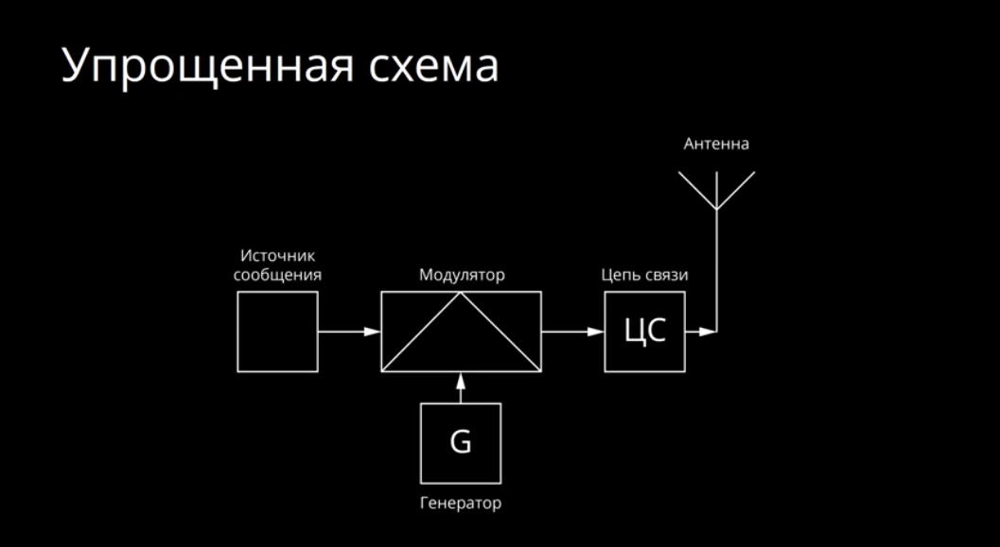
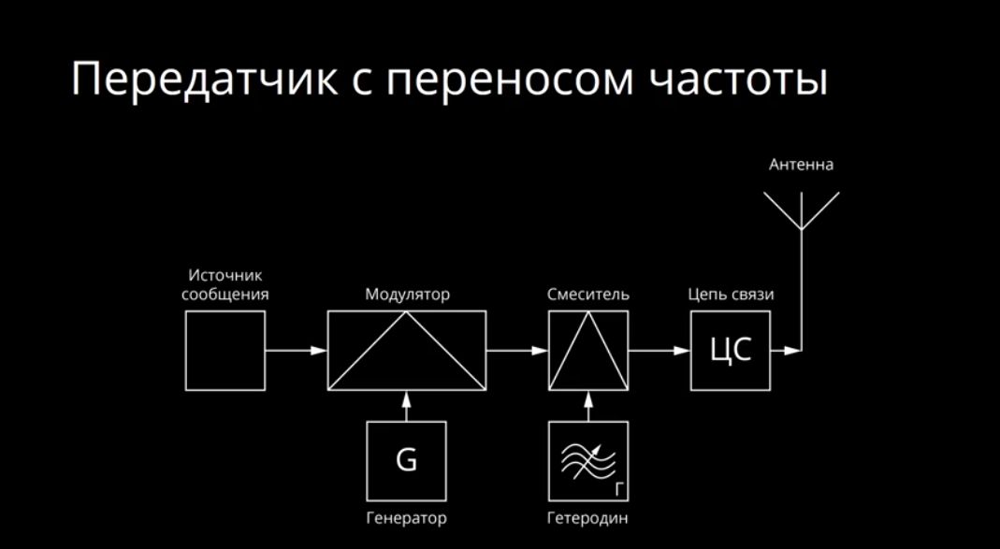
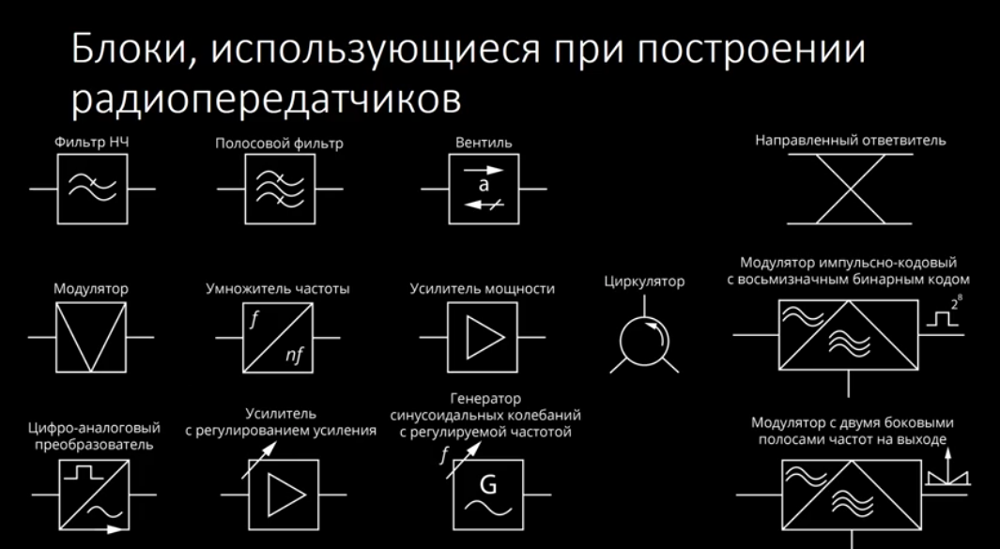
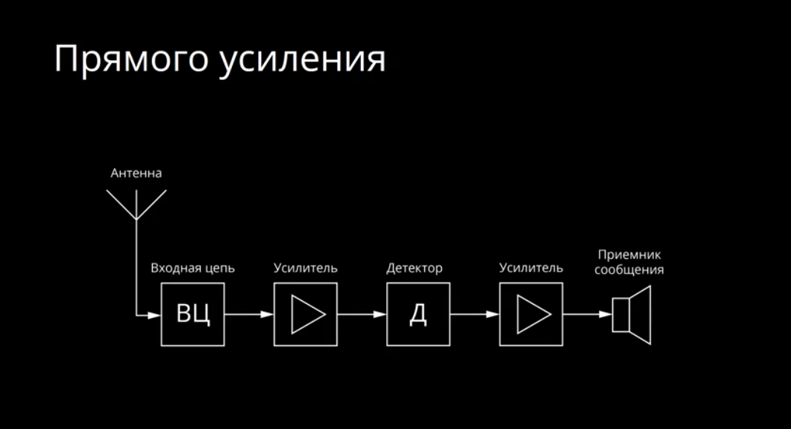
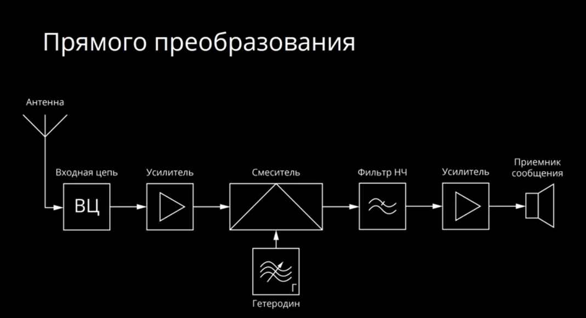
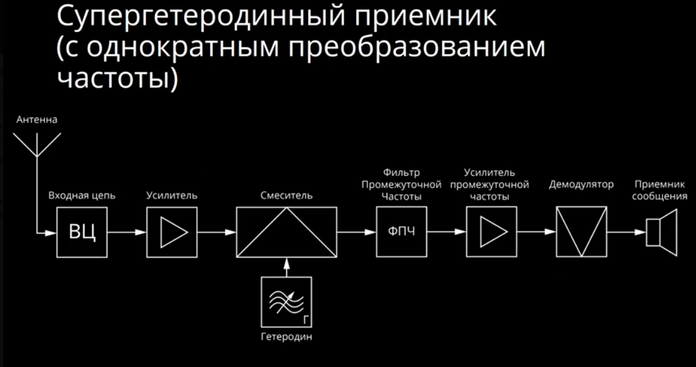
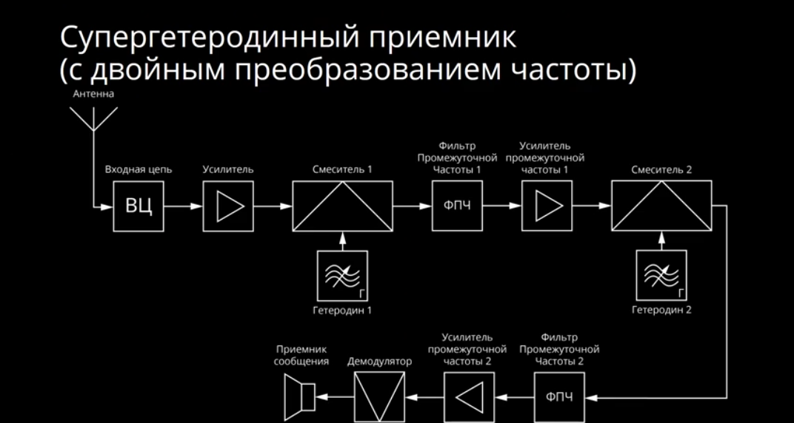
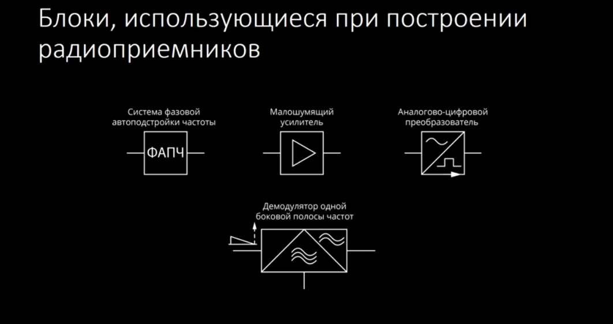

# Беспроводные телекоммуникационные системы

## Лекция 2. Радиопередатчики и радиоприемники (08.03.2019)

### Структурная схема радиопередатчика ###

#### Упрощенная схема: ####

**Источник сообщения** - может быть микрофон либо какое-то цифровое записывающее устройство

**Генератор** - устройство, генерирующее колебания различной частоты и мощности

**Модулятор** - устройство, способное изменять частоту генератора по определенному закону, который он получает от источника.

**Цепь связи** - устройство, которое позволяет связать модулятор с передающей антенной

#### Передатчик с переносом частоты: ####

**Смеситель** - также называют умножителем частоты, либо переносчиком частот вверх, либо вниз. Используется для того, чтобы промодулированное колебание перевести на более высокую частоту.

**Гетеродин** - вырабатывает колебания высокой частоты малой мощности.

Также в передатчиках могут использоваться следующие блоки:

**Фильтр НЧ** - позволяет пропустить все колебания ниже определенной частоты и подавить те, которые находятся выше.

**Полосовой фильтр** - выделят полосу частот и не пропускаяет частоты ниже и выше этой полосы.

**Вентиль** - чаще применяется в технике сверхвысоких частот. Позволяет пропускать сигналы в одну сторону, но не пропускать в другую.

**Направленный ответвитель** - устройство позволяющее часть мощности пропускать в одном направлении и небольшую его долю ответвлять в другое направление.

**Усилитель мощности** - усиливает сигнал, чтобы его можно было передать на большее расстояние

**Циркулятор** - позволят передавать сигнал на разные входы, по кругу, по часовой стрелке.

**Цифро-аналоговой преобразователь** - из цифрового набора данных получает аналоговой сигнал, который далее передается радиопередающем устройством.

**Усилитель с регулированием усиления** - часто используется с **направленным ответвителем**

### Приемники и из типы ###

#### Приемник прямого усиления ####

**Входная цепь** - *позволяет например настроится на определенный канал*

**Усилитель** - усиливает слабые принимаемые сигналы

**Детектор** - *например, может быть амплитудный детектор, который промодулированный сигнал переводит в низкочастотную область и позволят после прохождения усилителя получить на приемнике сообщение (например, на динамики)*

#### Приемник прямого преобразования ####

Добавляется **смеситель** с **гетеродином**, которые переносят сигнал на нулевую частоту.

#### Супергетеродинный приемник (с однократным преобразованием частоты) ####

**Фильтр промежуточной частоты** - выделяет только конкретные частоты и подавляет все остальные.

#### Супергетеродинный приемник (с двойным преобразованием частоты) ####

Такой приемник позволяет отфильтровать зеркальные каналы, которые возникают в приемнике и соседние каналы.

Также в приемниках могут использоваться следующие блоки:

**Система физовой автоподстройки частоты** - используется для того, чтобы синхронизировать **гетеродин** с сигналом принимаемой частоты.

**Малощумящий усилитель** - обычно устанавливается после антенного устройства для того чтобы усилить принимаемый сигнал.

**Аналогово-цифровой преобращователь** - используется для перевода аналогово сигнала в цифровой обычно ставится после демодулятора, либо до демодулятора
