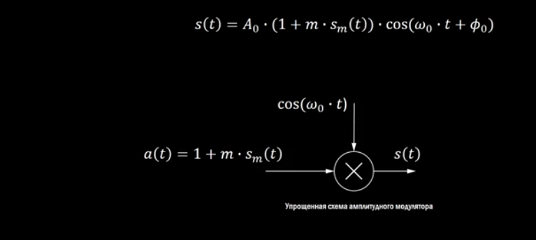
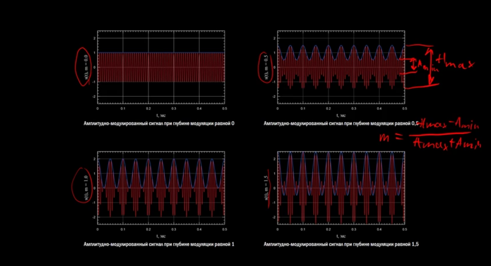
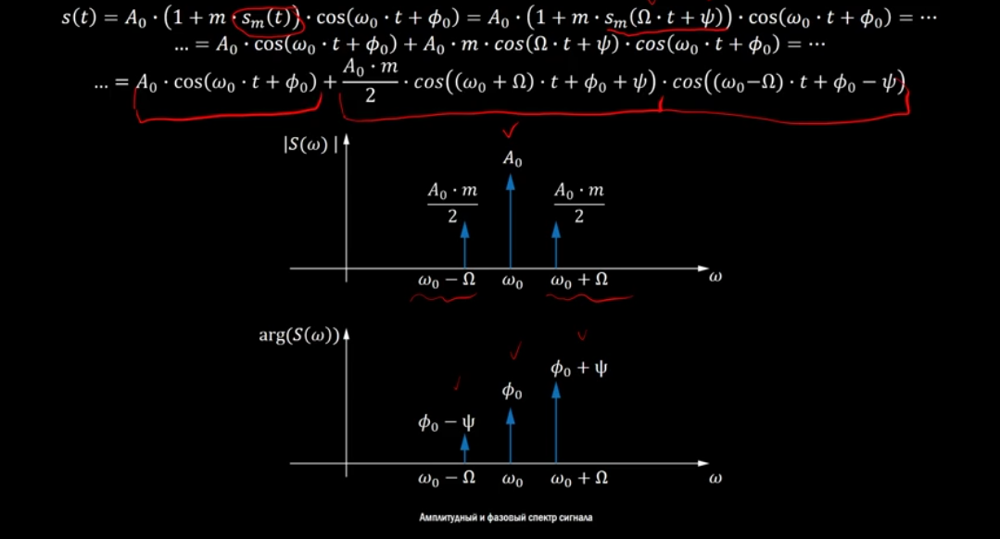
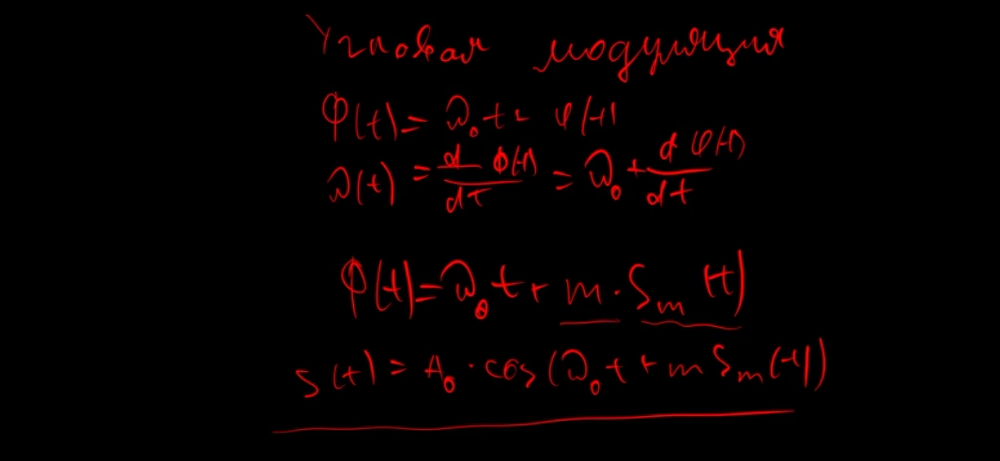

# Беспроводные телекоммуникационные системы

## Лекция 3. Модуляция сигналов (16.03.2019)

### Амплитудная модуляция ###

#### Формула амплитудно модулированного сигнала *(вверху слайда)*:

	s(t) - это модулированное сообщение

	A - это множитель показывающий амплитуду

	cos(ω * t + φ) - это множители показывающие несущее колебание, ω - частота,  φ - начальная фаза колебания

	(1 + m * s(t)) - это само сообщение, m - это индекс модуляции

#### Упрощенная схема Амплитудного модулятора состоит из:
умножителя на которое подается несущее колебание *cos(ω * t)* и сформированное сообщение *a(t) = 1 + m * s(t)*. На выходе получается Амплитудно модулированный сигнал *s(t)*.

#### Примеры амлитудно-модулированного сигнала:

Если индекс модуляции превышает 1, то такой такой сигнал считается **перемодулированным**, такой случай не желателен.

Для определения глубины модуляции по временной диаграмме берем максимальную амплитуду и называем Amax, и минимальную амплитуду, которую обозначаем Amin. 

**Индекс (глубину) модуляции находим по формуле:**

	m = Amax - Amin / Amax + Amin

### Угловая модуляция ###

> PS. Наиболее правильные формулы на слайде

**Полная фаза радио-сигнала записывается как:**

	Φ(t) = ω*t + φ(t)

**Мгновенная частота радио-сигнала:** *(вычисляется как производная от полной фазы)*

	ω(t) = dφ(t) / dt = ω + dφ(t) / dt

#### Фазовая модуляция:

Сигналы у которых изменяется полная фаза, в соответствии с модулирующим сигналом, называются **сигналами с угловой модуляцией в общем виде**. 

Изменение фазы в соотвествии с модулирующим сигналом при фазовой модуляции:

	Φ(t) = ω * t + m * Sm(t), где Sm - модулирующее сообщение; m - индекс фазовой модуляции

Сам радио-сигнал в таком случае можно записать как:

	S(t) = A * cos(ω * t + m * Sm(t))

#### Частотная модуляция:

> PS. Наиболее правильные формулы на слайде

В отличии от фазовой модуляции при частотной модуляции происходит изменение мгновенной частоты радиосигнала.

	ω(t) = ω0 + ωд * Sm(t), где ωд - индекс частотной  модуляции (девиация частоты)

Полная фаза радио-сигнала можно записать:

	Φ(t) = ∫ω(t)dt = ω0 * t + ωд * ∫Sm(t) * dt + 0

Сигнал с частотной модуляцией:

	S(t) = A0 * cos(ω0 * t + ωд * ∫Sm(t) * dt + φ0)

### Широтно-импульсная модуляция

### Импульсно-кодовая модуляция

***
## Решение задач к лекции 3

### Задача 1.

**Условие:**

Максимальное значение напряжения сигнала с амплитудной модуляцией равно 3 В, минимальное – 1 В. Чему равен коэффициент модуляции?

**Дано:**

Amax = 3 В

Amin = 1 В

**Найти:**

m *это коэффициент модуляции*

**Мой Комментарий:**

Данные, которые присутствуют в условии задачи можно взять измерив амплитуду сигнала на временной диаграмме. 

Для нахождения коэффициента модуляции используется формула:

	m = Amax - Amin / Amax + Amin

**Решение:**

1. m = 3 - 1 / 3 + 1 = 0.5

**Ответ:** Коэффициент модуляции 0.5